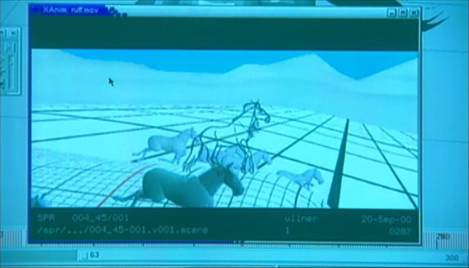
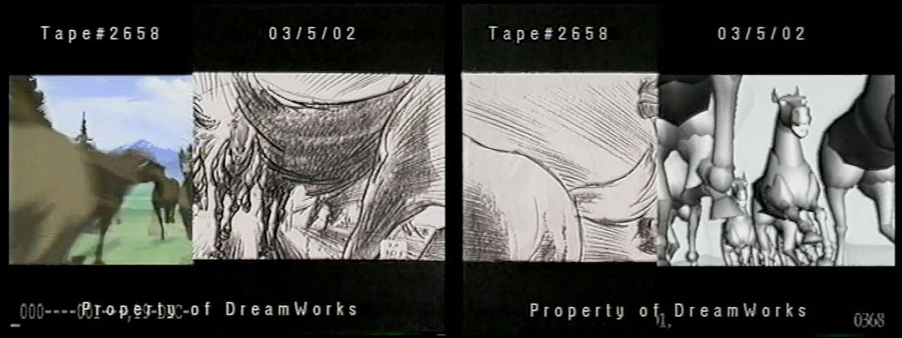
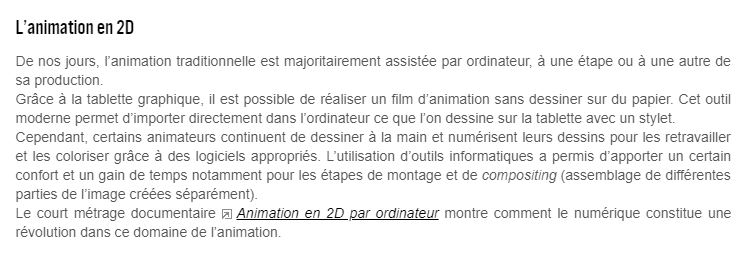
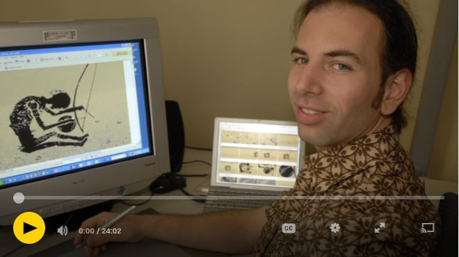

 

### Vous êtes ici

 

[Accueil](index.md)

1. [Une introduction à l'animation](histoire.md)

    - **Le développement de la 2D**
    - [Le passage à la 3D](3d.md)
    - [L'animation en volume ou 3D réelle](envolume.md)
    
        * [Le stop-motion](stopmotion.md)
        * [La pixilation et la rotoscopie](pixilation.md)

2. [L'animation par ordinateur](parordinateur.md)

    - [Une science technologique](science.md)
    
        * [Les formations](formation.md)
    
    - [Les images de synthèse](imagesdesynthèse.md)
    
        * [Les principes du numérique](numerique.md)
        * [Les effets spéciaux](effet.md)
        * [L'illusion des décors et accessoires](decor.md)
        
    - [La motion capture](motioncapture.md)
    
        * [L'étude du mouvement](etude.md)
        * [La mise en mouvement](mouvement.md)
        * [La modélisation des corps](corps.md)

    - [Les évolutions en cours et futures](evolution.md)
    
        * [Le ray tracing ou photoréalisme](photorealisme.md)
        
 

--------------------------------------------------------

 

# Une introduction à l'animation
# Le développement de la 2D

 

Cette page contient des références définissant, plus précisément, l'animation 2D - ou du moins pas encore tout à fait 3D - et illustrant brièvement le propos.

 

##### L’animation de ‘’Spirit’’. In _Spirit : Stallion of the Cimarron_. Film d’animation, aventure et famille. Réalisé par Kelly Asbury et Lorna Cook, DreamWorks. Diffusé le 9 octobre 2002. 1h 24min

> _« Le projet d’animation de Spirit fut mis sur pied il y a quatre ans suite à la décision de réaliser un nouveau genre de film d’animation : un mélange d’animation dessinée à la main et générée par ordinateur, créant ainsi le film d’animation le plus complexe à ce jour. À mes yeux, c’est la reconception, la reconstruction et la réinvention de l’animation traditionnelle. Le but était de créer un film qui utilise les éléments uniques de l’animation traditionnelle tout en créant un monde et un environnement que le public a l’habitude de voir dans les films en 3D. Je pense que l’association de ces deux concepts donnera naissance à un nouveau genre d’animation. Ce n’est plus traditionnel, ce n’est pas digital, donc j’ai appelé ça tra-digital ! Les outils et la technologie développés pour Spirit sont les plus avancés à ce jour. Les animateurs travaillent sur des machines très puissantes et vous verrez ce qui résulte dans Spirit. »_

 

##### CICLIC CENTRE-VAL DE LOIRE. « Séance 9 : animation par ordinateur » [en ligne]. In _Upopi : Université populaire des images. 2014 [consulté le 19 mai 2019]_. Disponible sur le Web : [http://upopi.ciclic.fr/transmettre/parcours-pedagogiques/initiation-au-cinema-d-animation/seance-9-animation-par-ordinateur](http://upopi.ciclic.fr/transmettre/parcours-pedagogiques/initiation-au-cinema-d-animation/seance-9-animation-par-ordinateur)

 

##### TASSEL, Tom. « 24 idées/seconde - animation 2D par ordinateur » [en ligne]. In Canada.ca. _National Film Board of Canada (NFB)_. Publié en 2006 [consulté le 8 juin 2019]. 24 minutes 2 secondes. Disponible sur le Web : [https://www.nfb.ca/film/24_idees_seconde_animation_2d/](https://www.nfb.ca/film/24_idees_seconde_animation_2d/)

 
