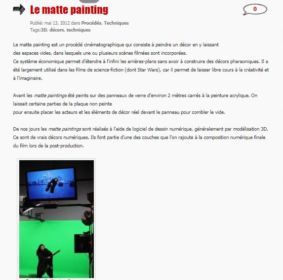

 

### Vous êtes ici

 

[Introduction à l'animation](index.md)

1. [L'animation en volume ou 3D réel](envolume.md)

    - [Le stop-motion](stopmotion.md)
    - [La pixilation](pixilation.md)
    
2. [L'animation par ordinateur](parordinateur.md)

    - [L'animation et effets spéciaux numériques](numerique.md)
    
        * **La 2D**
        * [La 3D](3d.md)
        
    - [Les images de synthèse](imagesdesynthèse.md)    
        * [L'organic motion](organicmotion.md)
        * [Le ray tracing ou photoréalisme](photorealisme.md)
        * [Le motion capture](motioncapture.md)

 

--------------------------------------------------------------------

 

# L'ANIMATION PAR ORDINATEUR

# L'animation et effets spéciaux numériques

## La 2D

 

Explication du principe de base.

 

##### CICLIC CENTRE-VAL DE LOIRE. « Séance 9 : animation par ordinateur » [en ligne]. In _Upopi : Université populaire des images. 2014 [consulté le 19 mai 2019]_. Disponible sur le Web : [http://upopi.ciclic.fr/transmettre/parcours-pedagogiques/initiation-au-cinema-d-animation/seance-9-animation-par-ordinateur](http://upopi.ciclic.fr/transmettre/parcours-pedagogiques/initiation-au-cinema-d-animation/seance-9-animation-par-ordinateur)

 

##### L’animation de ‘’Spirit’’. In _Spirit : Stallion of the Cimarron_. Film d’animation, aventure et famille. Réalisé par Kelly Asbury et Lorna Cook, DreamWorks. Diffusé le 9 octobre 2002. 1h 24min

> _« Le projet d’animation de Spirit fut mis sur pied il y a quatre ans suite à la décision de réaliser un nouveau genre de film d’animation : un mélange d’animation dessinée à la main et générée par ordinateur, créant ainsi le film d’animation le plus complexe à ce jour. À mes yeux, c’est la reconception, la reconstruction et la réinvention de l’animation traditionnelle. Le but était de créer un film qui utilise les éléments uniques de l’animation traditionnelle tout en créant un monde et un environnement que le public a l’habitude de voir dans les films en 3D. Je pense que l’association de ces deux concepts donnera naissance à un nouveau genre d’animation. Ce n’est plus traditionnel, ce n’est pas digital, donc j’ai appelé ça tra-digital ! Les outils et la technologie développés pour Spirit sont les plus avancés à ce jour. Les animateurs travaillent sur des machines très puissantes et vous verrez ce qui résulte dans Spirit. »_

 

##### Tsui Hark et les combats. In _Di Renjie : Shen du long wang_. Film d’action, aventure et arts martiaux. Réalisé par Tsui Hark, Huayi Corporation. Diffusé le 6 août 2014. 2h 14min

 

##### WORDPRESS. « Le matte painting » [en ligne]. In _Les effets spéciaux numériques_. [Consulté le 5 mai 2019]. Disponible sur le Web: [https://effetsspeciaux.wordpress.com/2012/05/13/le-matte-painting/](https://effetsspeciaux.wordpress.com/2012/05/13/le-matte-painting/)

 
