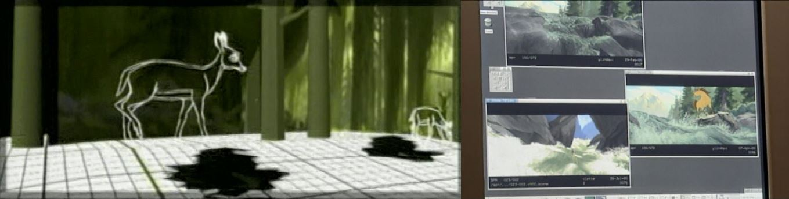
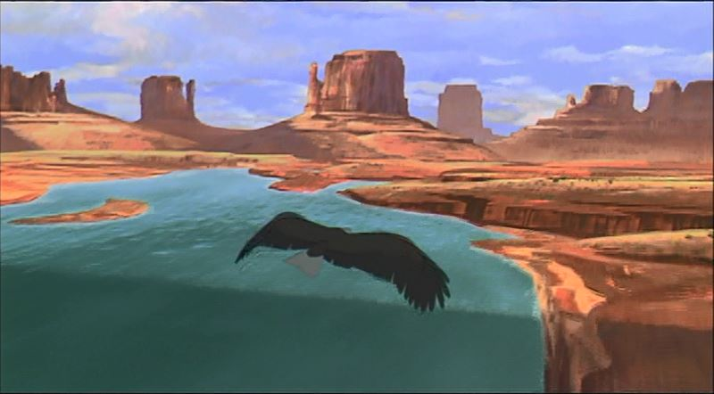
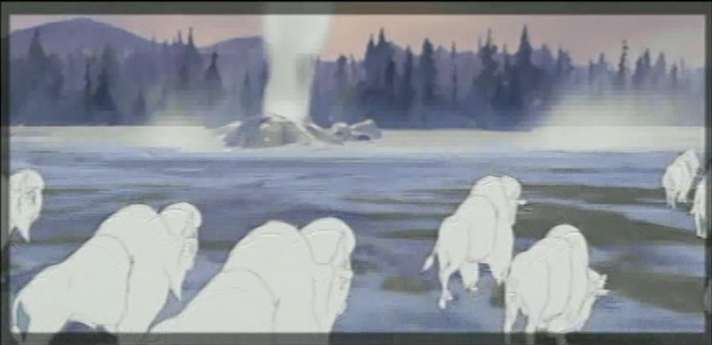
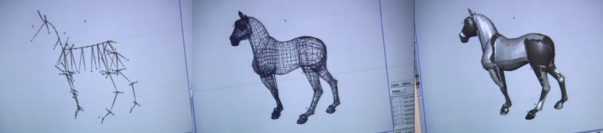
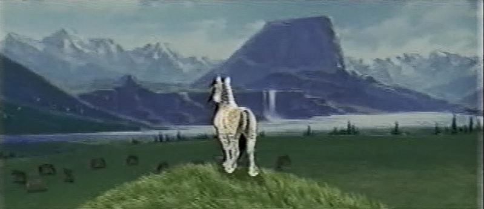
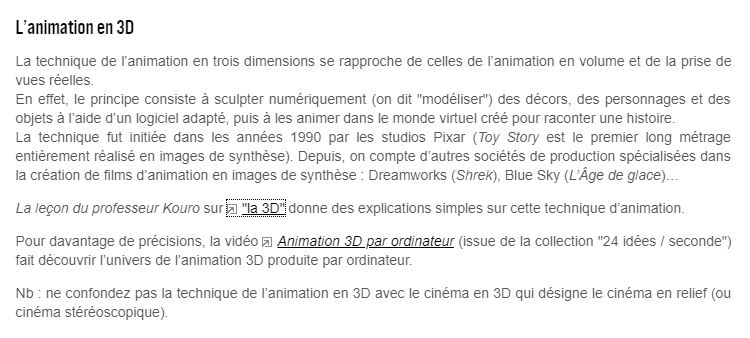
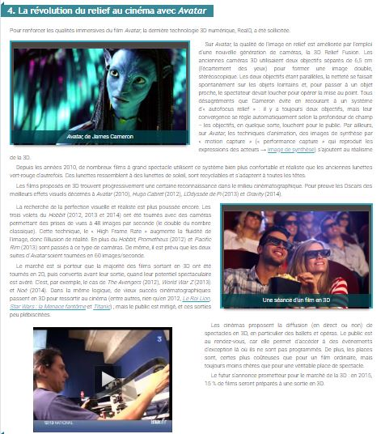
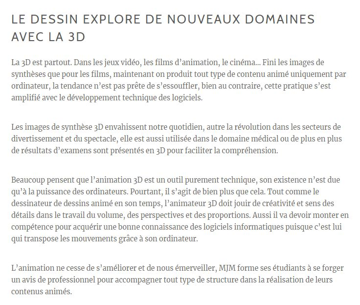
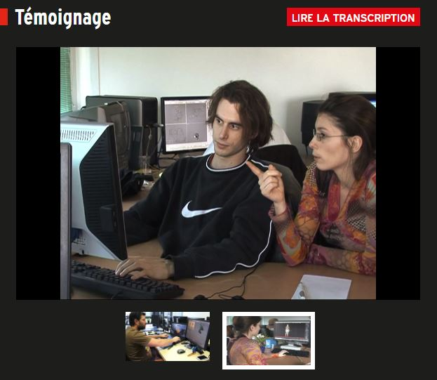
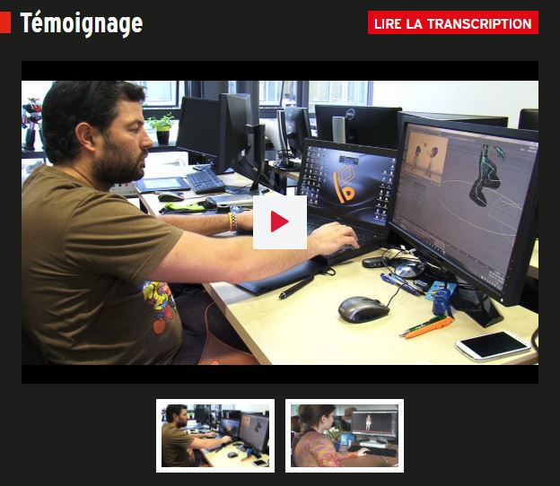

 

### Vous êtes ici

 

[Accueil](index.md)

1. [Une introduction à l'animation](histoire.md)

    - [Le développement de la 2D](2d.md)
    - **Le passage à la 3D**
    - [L'animation en volume ou 3D réelle](envolume.md)
    
        * [Le stop-motion](stopmotion.md)
        * [La pixilation et la rotoscopie](pixilation.md)

2. [L'animation par ordinateur](parordinateur.md)

    - [Une science technologique](science.md)
    
        * [Les formations](formation.md)
    
    - [Les images de synthèse](imagesdesynthèse.md)
    
        * [Les principes du numérique](numerique.md)
        * [Les effets spéciaux](effet.md)
        * [L'illusion des décors et accessoires](decor.md)
        
    - [La motion capture]()
    
        * [L'étude du mouvement]()
        * [La mise en mouvement]()
        * [La modélisation des corps](corps.md)

    - [Les évolutions en cours et futures](evolution.md)
    
        * [Le ray tracing ou photoréalisme]()
        
 

--------------------------------------------------------

 

# Une introduction à l'animation
## Le passage à la 3D

 

Une ou deux lignes qui expliquent ce qu’on retrouve dans cette classe. Ensuite, publication des différentes ressources trouvées.

 

###### L’animation de ‘’Spirit’’. In _Spirit : Stallion of the Cimarron_. Film d’animation, aventure et famille. Réalisé par Kelly Asbury et Lorna Cook, DreamWorks. Diffusé le 9 octobre 2002. 1h 24min

> _« Une séquence d’ouverture époustouflante et novatrice présente la terre de Spirit : un plan continu de trois minutes qui repousse les limites techniques et artistiques de l’animation. D’un point de vue technique, tout y est. La caméra traverse les canyons, survole la rivière et vole avec l’aigle – ce qui était presque impossible auparavant. Ce sont les derniers progrès de l’animation. On a passé 9 mois à créer le mouvement de caméra pour ce plan. Il n’y a pas de coupe, on reste immergé dans ce monde, où nous survolons les plus grands reliefs et lieux naturels du Far West. »_

> _« Presque tous les paysages sont faits en 3D et on y a intégré des personnages en 2D pour qu’ils se fondent parfaitement. On voit Spirit courir avec son troupeau, aller sur le promontoire puis la caméra tourne sur 360 degrés autour de Spirit. Une partie en est générée par ordinateur, puis on passe de manière homogène à l’animation de James Baxter. Il est impossible de déceler la transition. »_

 

##### CICLIC CENTRE-VAL DE LOIRE. « Séance 9 : animation par ordinateur » [en ligne]. In _Upopi : Université populaire des images. 2014 [consulté le 19 mai 2019]_. Disponible sur le Web : [http://upopi.ciclic.fr/transmettre/parcours-pedagogiques/initiation-au-cinema-d-animation/seance-9-animation-par-ordinateur](http://upopi.ciclic.fr/transmettre/parcours-pedagogiques/initiation-au-cinema-d-animation/seance-9-animation-par-ordinateur)

 

###### LAROUSSE.  « Image en relief ou image en 3D » [en ligne]. [Consulté le 20 mai 2019]. Disponible sur le Web : <http://www.larousse.fr/encyclopedie/divers/image_en_relief/187689>

 

##### MJM VIDÉO/ANIMATION. « Comment réaliser une bonne animation ? » [en ligne]. [Consulté le 30 mai 2019]. Disponible sur le Web: <https://www.mjm-video-animation.com/comment-realiser-une-bonne-animation-video/>

 

##### VALLÉE, Réjane ; RENOUARD, Caroline et YUN, Christine. « Animateur/animatrice 2D et 3d : Témoignage » [en ligne]. In Onisep. 2014 [consulté le 30 mai 2019]. 4 minutes 12 secondes et 2 minutes 26 secondes. Disponible sur le Web : [http://www.onisep.fr/Ressources/Univers-Metier/Metiers/animateur-animatrice-2D-et-3D](http://www.onisep.fr/Ressources/Univers-Metier/Metiers/animateur-animatrice-2D-et-3D)

 
