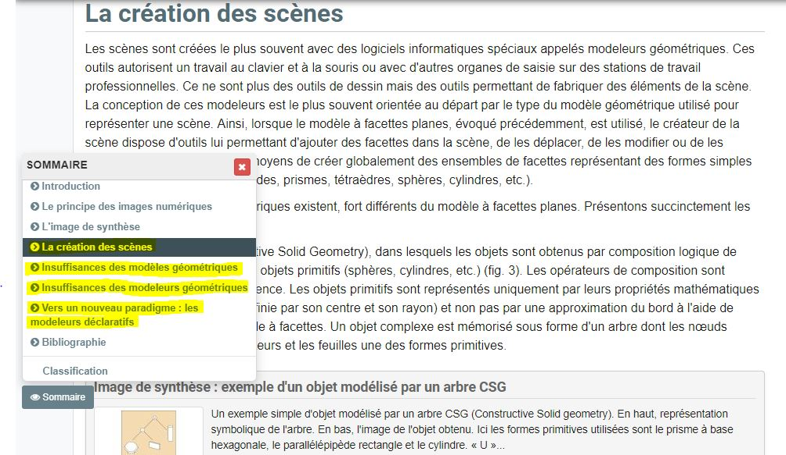

 

### Vous êtes ici

 

[Introduction à l'animation](index.md)

1. [L'animation en volume ou 3D réel](envolume.md)

    - [Le stop-motion](stopmotion.md)
    - [La pixilation](pixilation.md)
    
2. [L'animation par ordinateur](parordinateur.md)

    - [L'animation et effets spéciaux numériques](numerique.md)
    
        * [La 2D](2d.md)
        * **La 3D**
        
    - [Les images de synthèse](imagesdesynthèse.md)    
    
        * [L'organic motion](organic.md)
        * [Le ray tracing ou photoréalisme](photorealisme.md)
        * [Le motion capture](motioncapture.md)

 

-------------------------------------------------------------------

 

# L'ANIMATION PAR ORDINATEUR

# L'animation et effets spéciaux numériques

## La 3D

 

Explication des principes de base.

 

###### Capture d'écran de la réalisation du film d'animation Spirit.

> _Noter quelques extraits explicatifs des dires des réalisateurs._

 

##### CICLIC CENTRE-VAL DE LOIRE. « Séance 9 : animation par ordinateur » [en ligne]. In _Upopi : Université populaire des images. 2014 [consulté le 19 mai 2019]_. Disponible sur le Web : [http://upopi.ciclic.fr/transmettre/parcours-pedagogiques/initiation-au-cinema-d-animation/seance-9-animation-par-ordinateur](http://upopi.ciclic.fr/transmettre/parcours-pedagogiques/initiation-au-cinema-d-animation/seance-9-animation-par-ordinateur)

 

##### DREAMWORKS ANIMATION. « Technology » [en ligne]. Mis à jour en 2019 [consulté le 20 mai 2019]. Disponible sur le Web: [https://www.dreamworksanimation.com/](https://www.dreamworksanimation.com/)

 

###### LAROUSSE.  « Image en relief ou image en 3D » [en ligne]. [Consulté le 20 mai 2019]. Disponible sur le Web : <http://www.larousse.fr/encyclopedie/divers/image_en_relief/187689>

 

##### LEBRUN, Caroline. « La 3D dans la peau ! » [en ligne]. 01net. Publié le 8 juin 2006 [consulté le 7 juin 2019]. Disponible sur le Web : <https://www.01net.com/astuces/la-3d-dans-la-peau-321014.html>

 

##### MARTIN, Philippe et MARTIN, Dominique. « Images numérique et image de synthèse : La création des scènes » [en ligne]. In _Encyclopædia Universalis_. [Consulté le 19 mai 2019]. Disponible sur le Web: [https://www.universalis.fr/encyclopedie/image-numerique-et-image-de-synthese/3-la-creation-des-scenes/](https://www.universalis.fr/encyclopedie/image-numerique-et-image-de-synthese/3-la-creation-des-scenes/)

 

##### MJM VIDÉO/ANIMATION. « Comment réaliser une bonne animation ? » [en ligne]. [Consulté le 30 mai 2019]. Disponible sur le Web: <https://www.mjm-video-animation.com/comment-realiser-une-bonne-animation-video/>

 
