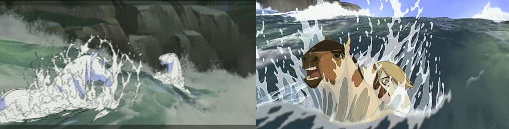
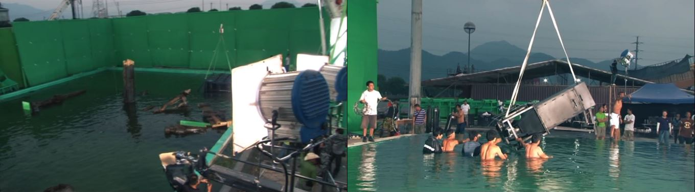
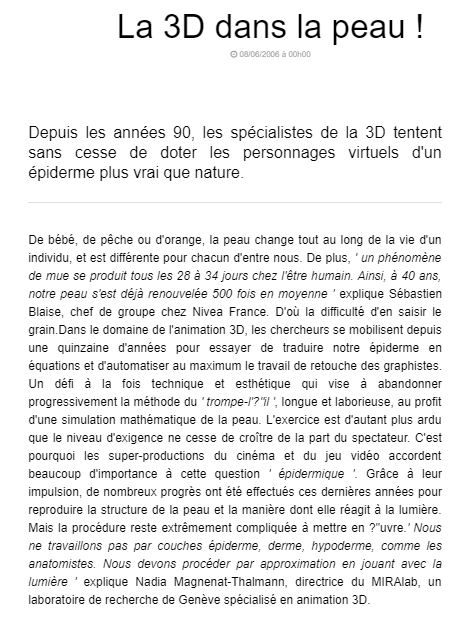

 

### Vous êtes ici

 

[Accueil](index.md)

1. [Une introduction à l'animation](histoire.md)

    - [Le développement de la 2D]()
    - **Le passage à la 3D**
    - [L'animation en volume ou 3D réelle](envolume.md)
    
        * [Le stop-motion](stopmotion.md)
        * [La pixilation et la rotoscopie](pixilation.md)

2. [L'animation par ordinateur](parordinateur.md)

    - [Une science technologique]()
    
        * [Les formations](formation.md)
    
    - [Les images de synthèse]()
    
        * [Les principes du numérique]()
        * [Les effets spéciaux]()
        * [L'illusion des décors et accessoires](decor.md)
        
    - [La motion capture]()
    
        * [L'étude du mouvement]()
        * [La mise en mouvement]()
        * [La modélisation des corps]()

    - [Les évolutions en cours et futures](evolution.md)
    
        * [Le ray tracing ou photoréalisme]()
        
 

--------------------------------------------------------

 

# Une introduction à l'animation
## Le passage à la 3D

 

Une ou deux lignes qui expliquent ce qu’on retrouve dans cette classe. Ensuite, publication des différentes ressources trouvées.

 

##### VALLÉE, Réjane ; RENOUARD, Caroline et YUN, Christine. « Animateur/animatrice 2D et 3d : Témoignage » [en ligne]. In Onisep. 2014 [consulté le 30 mai 2019]. 4 minutes 12 secondes et 2 minutes 26 secondes. Disponible sur le Web : [http://www.onisep.fr/Ressources/Univers-Metier/Metiers/animateur-animatrice-2D-et-3D](http://www.onisep.fr/Ressources/Univers-Metier/Metiers/animateur-animatrice-2D-et-3D)

 

-----------------------------------------------------

 

### Vous êtes ici

 

[Introduction à l'animation](index.md)

1. [L'animation en volume ou 3D réel](envolume.md)

    - [Le stop-motion](stopmotion.md)
    - [La pixilation](pixilation.md)
    
2. [L'animation par ordinateur](parordinateur.md)

    - [L'animation et effets spéciaux numériques](numerique.md)
    
        * [La 2D](2d.md)
        * **La 3D**
        
    - [Les images de synthèse](imagesdesynthèse.md)    
    
        * [L'organic motion](organicmotion.md)
        * [Le ray tracing ou photoréalisme](photorealisme.md)
        * [Le motion capture](motioncapture.md)

 

-------------------------------------------------------------------

 

# L'ANIMATION PAR ORDINATEUR

# L'animation et effets spéciaux numériques

## La 3D

 

Explication des principes de base.

 

###### L’animation de ‘’Spirit’’. In _Spirit : Stallion of the Cimarron_. Film d’animation, aventure et famille. Réalisé par Kelly Asbury et Lorna Cook, DreamWorks. Diffusé le 9 octobre 2002. 1h 24min

> _« Une séquence d’ouverture époustouflante et novatrice présente la terre de Spirit : un plan continu de trois minutes qui repousse les limites techniques et artistiques de l’animation. D’un point de vue technique, tout y est. La caméra traverse les canyons, survole la rivière et vole avec l’aigle – ce qui était presque impossible auparavant. Ce sont les derniers progrès de l’animation. On a passé 9 mois à créer le mouvement de caméra pour ce plan. Il n’y a pas de coupe, on reste immergé dans ce monde, où nous survolons les plus grands reliefs et lieux naturels du Far West. »_

> _« Presque tous les paysages sont faits en 3D et on y a intégré des personnages en 2D pour qu’ils se fondent parfaitement. On voit Spirit courir avec son troupeau, aller sur le promontoire puis la caméra tourne sur 360 degrés autour de Spirit. Une partie en est générée par ordinateur, puis on passe de manière homogène à l’animation de James Baxter. Il est impossible de déceler la transition. »_

> _« Dans Spirit, les effets étaient très naturels. Il y a beaucoup d’éléments organiques – eau, feu, poussière. Le travail consistait à créer les éléments naturels : le brouillard, la neige, le scintillement des étoiles. C’est un plus par rapport à l’animation traditionnelle. Une des séquences les plus spectaculaires, c’est lorsque Rivière est sauvée. Les deux personnages principaux sont emportés dans des rapides. Tandis que les personnages sont dessinés à la main, l’environnement est généré par ordinateur puis intégré à l’animation en 2D. Ça, c’est un effet d’éclaboussement dessiné à la main et c’est comme ça qu’on a obtenu cette mousse à la surface. Pour captiver le public, on a adopté un style de prise de vues réelles. On a utilisé des décors informatiques pour pouvoir se déplacer sur trois dimensions et on a mis la caméra sur l’eau, comme si elle filmait d’un radeau. Ça produit l’effet dramatique d’un tournage caméra à l’épaule. Pourvoir créer de tels effets qui sont intégrés dans ces paysages magnifiques et avec une animation incroyable… Rien que de savoir le nombre de personnes qui travaillent dessus et la réflexion que demande chaque scène, c’est impressionnant. »_

 

##### CGMeetup. « Houdini tutorial » [en ligne]. In YouTube. Publié en 2015  [consulté le 28 mai 2019]. Playlist : 7 vidéos. Disponible sur le Web : [https://www.youtube.com/watch?v=eVKODWtBmGc&list=PLc6NCp8iAPDbmC29V3rln_m6B8ZpWZtoo](https://www.youtube.com/watch?v=eVKODWtBmGc&list=PLc6NCp8iAPDbmC29V3rln_m6B8ZpWZtoo)

 

##### CICLIC CENTRE-VAL DE LOIRE. « Séance 9 : animation par ordinateur » [en ligne]. In _Upopi : Université populaire des images. 2014 [consulté le 19 mai 2019]_. Disponible sur le Web : [http://upopi.ciclic.fr/transmettre/parcours-pedagogiques/initiation-au-cinema-d-animation/seance-9-animation-par-ordinateur](http://upopi.ciclic.fr/transmettre/parcours-pedagogiques/initiation-au-cinema-d-animation/seance-9-animation-par-ordinateur)

 

##### DREAMWORKS ANIMATION. « Technology » [en ligne]. Mis à jour en 2019 [consulté le 20 mai 2019]. Disponible sur le Web: [http://www.dreamworksanimation.com/technology/](http://www.dreamworksanimation.com/technology/)

 

##### L’équipe technique. In _Di Renjie : Shen du long wang_. Film d’action, aventure et arts martiaux. Réalisé par Tsui Hark, Huayi Corporation. Diffusé le 6 août 2014. 2h 14min

> _« Pour le premier volet, on a investi 900 millions. Celui-ci atteint le milliard. Beaucoup de choses ont changé. On a beaucoup investi dans les effets de lumière et de son. (…) Malgré tous les préparatifs, la pression est quand même forte. Pour les scènes au temple du Dragon des mers, il faut du gros matériel. Nos caméras étaient trop encombrantes. Nous en avons acheté des plus petites. (…) On arrive à faire aujourd’hui des choses qu’on n’imaginait pas avant. Nous avons mis à contribution notre savoir-faire et notre expérience pour créer une œuvre nouvelle. »_

> _« Tsui Hark voit toujours très grand, des scènes grandioses, mais il accorde de la place à la nouveauté et au sens du détail. Quand il conçoit le film, il se met à la place d’un spectateur qui veut en avoir pour son argent. Je voulais de l’eau en 3D. On tourne sous l’eau, c’est une grande première ici. Ça s’explique par son goût du risque. Plus c’est difficile, plus il veut essayer. Un tournage classique dans l’eau, c’est déjà difficile. Alors en 3D… »_

> _« Je voulais voir un cavalier qui galope dans l’eau. C’est une image que j’avais depuis longtemps en tête, mais ça suppose un environnement maîtrisé. On a utilisé des bassins remplis d’eau. Le bassin fait 30 m par 60 m et 3 m de profondeur. On a mis 3 mois pour le construire. Tout ça pour quelques scènes. Nous avons fabriqué nos propres bouées. Nos propres coffrages. On a utilisé des machines à faire des vagues. Quand elles déferlent, c’est très réussi. Pour bien contrôler ce bassin, il faut du temps. Ça suppose un timing très précis. Quand on filme un corps qui bondit hors de l’eau, il faut avoir une bonne maîtrise de l’élément naturel. (…) On est allés à Yiwu pour louer une piscine plus profonde car il fallait 9 m de fond pour la scène avec le cheval. On a engagé une dizaine de plongeurs. Un Australien expert en images sous-marines. Avec la seule caméra permettant de telles prises de vues. Avec les autres appareils, il y avait 260 kilos de matériel. Le plus dur, c’est de tout coordonner dans un tel emplacement. »_

 

###### LAROUSSE.  « Image en relief ou image en 3D » [en ligne]. [Consulté le 20 mai 2019]. Disponible sur le Web : <http://www.larousse.fr/encyclopedie/divers/image_en_relief/187689>

 

##### LEBRUN, Caroline. « La 3D dans la peau ! » [en ligne]. 01net. Publié le 8 juin 2006 [consulté le 7 juin 2019]. Disponible sur le Web : <https://www.01net.com/astuces/la-3d-dans-la-peau-321014.html>

 

##### MARTIN, Philippe et MARTIN, Dominique. « Images numérique et image de synthèse : La création des scènes » [en ligne]. In _Encyclopædia Universalis_. [Consulté le 19 mai 2019]. Disponible sur le Web: [https://www.universalis.fr/encyclopedie/image-numerique-et-image-de-synthese/3-la-creation-des-scenes/](https://www.universalis.fr/encyclopedie/image-numerique-et-image-de-synthese/3-la-creation-des-scenes/)

 

##### MJM VIDÉO/ANIMATION. « Comment réaliser une bonne animation ? » [en ligne]. [Consulté le 30 mai 2019]. Disponible sur le Web: <https://www.mjm-video-animation.com/comment-realiser-une-bonne-animation-video/>

 

##### WATCHTHEDAILY. « Exclusive : Life of Pi's stunning effects » [en ligne]. In YouTube. Publié le 26 novembre 2012  [consulté le 20 mai 2019]. 2 minutes 14 secondes. Disponible sur le Web : [https://www.youtube.com/watch?v=9BrD_v5Vt70](https://www.youtube.com/watch?v=9BrD_v5Vt70)

 
