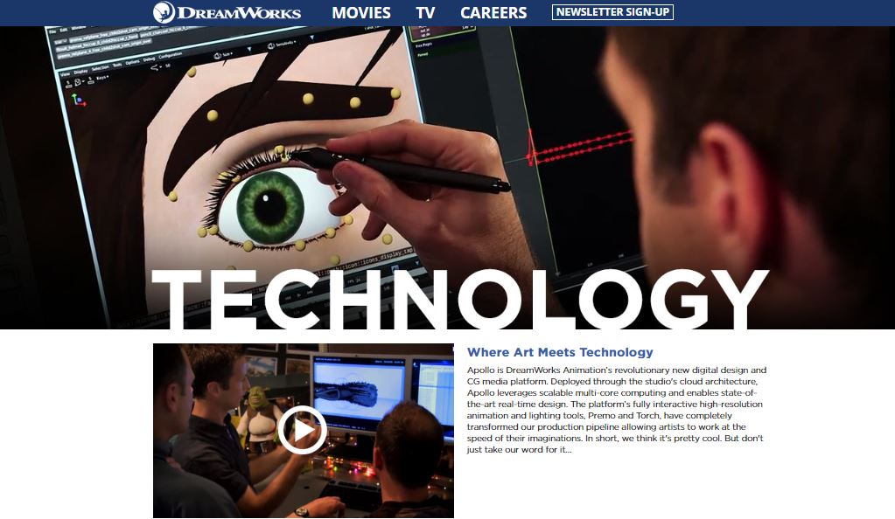
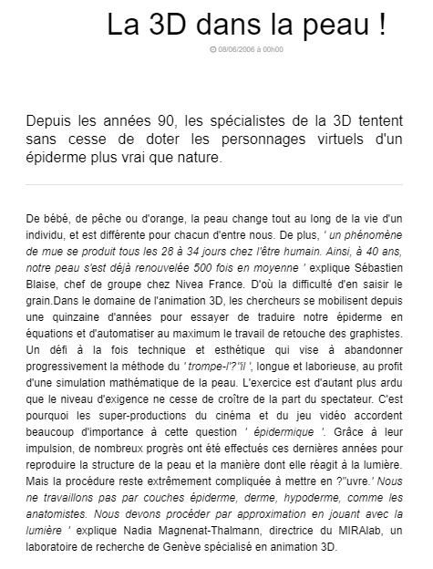
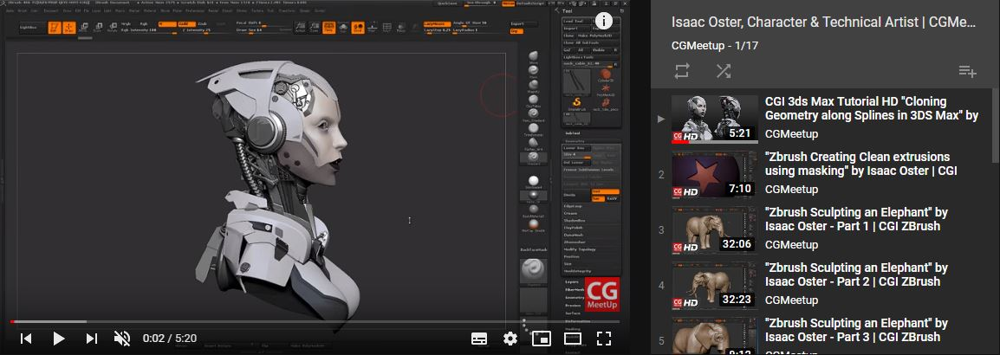

 

### Vous êtes ici

 

[Accueil](index.md)

1. Une introduction à l'animation](histoire.md)

    - [Le développement de la 2D](2d.md)
    - [Le passage à la 3D](3d.md)
    - [L'animation en volume ou 3D réelle](envolume.md)
    
        * [Le stop-motion](stopmotion.md)
        * [La pixilation et la rotoscopie](pixilation.md)

2. [L'animation par ordinateur](parordinateur.md)

    - [Une science technologique](science.md)
    
        * [Les formations](formation.md)
    
    - [Les images de synthèse](imagesdesynthèse.md)
    
        * [Les principes du numérique](numerique.md)
        * [Les effets spéciaux](effet.md)
        * [L'illusion des décors et accessoires](decor.md)
        
    - [La motion capture](motioncapture.md)
    
        * [L'étude du mouvement](etude.md)
        * [La mise en mouvement](mouvement.md)
        * **La modélisation des corps**

    - [Les évolutions en cours et futures](evolution.md)
    
        * [Le ray tracing ou photoréalisme](photorealisme.md)
        
 

--------------------------------------------------------

 

# L'ANIMATION PAR ORDINATEUR
# La motion capture
## La modélisation des corps

 

Une ou deux lignes qui expliquent ce qu’on retrouve dans cette classe. Ensuite, publication des différentes ressources trouvées.

 

##### DREAMWORKS ANIMATION. « Technology » [en ligne]. Mis à jour en 2019 [consulté le 20 mai 2019]. Disponible sur le Web: [http://www.dreamworksanimation.com/technology/](http://www.dreamworksanimation.com/technology/)

 

##### LEBRUN, Caroline. « La 3D dans la peau ! » [en ligne]. 01net. Publié le 8 juin 2006 [consulté le 7 juin 2019]. Disponible sur le Web : <https://www.01net.com/astuces/la-3d-dans-la-peau-321014.html>

 

##### OSTER, Isaac. « Isaac Oster, character & technical artist » [en ligne]. In YouTube. _CGMeetup_. Publié en 2015  [consulté le 28 mai 2019]. Playlist : 17 vidéos. Disponible sur le Web : [https://www.youtube.com/watch?v=kw0VGRRTX60&list=PLc6NCp8iAPDZoJZf-xZjqZgsk0P1oRsPb](https://www.youtube.com/watch?v=kw0VGRRTX60&list=PLc6NCp8iAPDZoJZf-xZjqZgsk0P1oRsPb)

 
