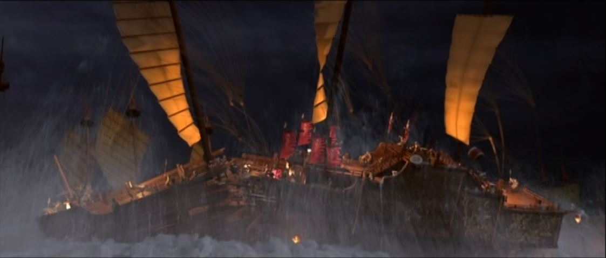
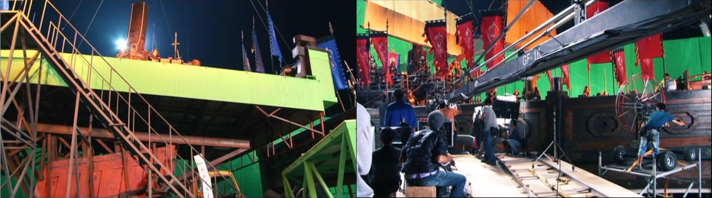
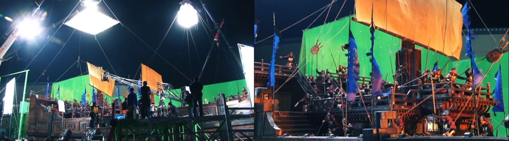
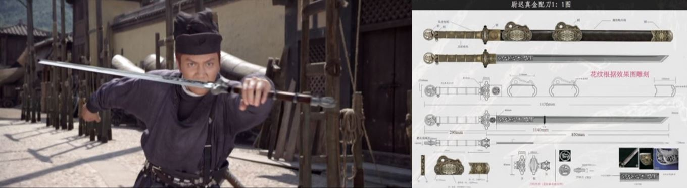
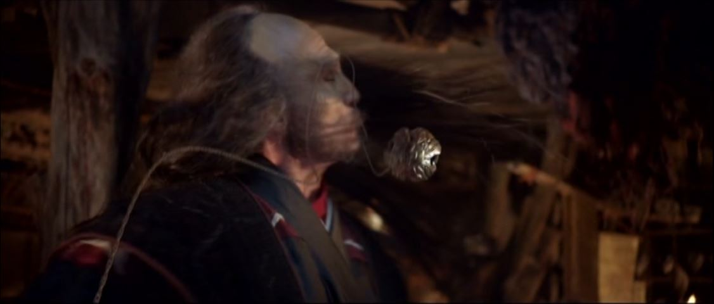
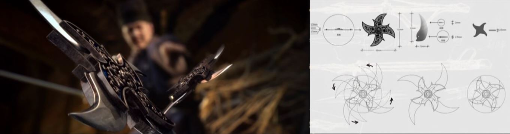
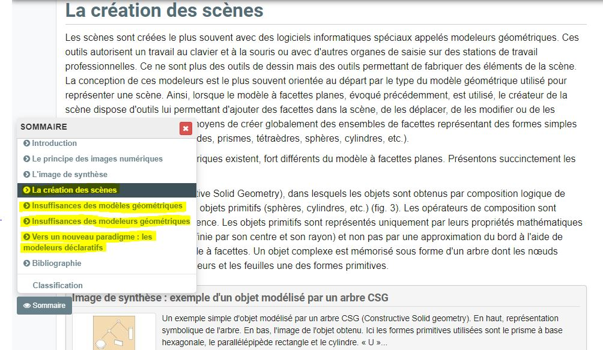
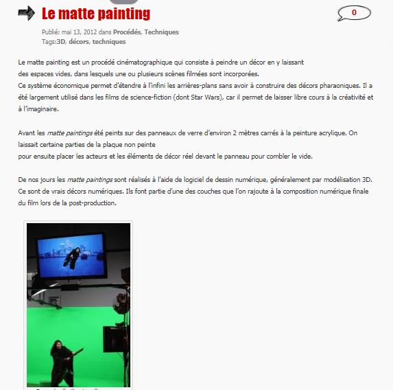

 

### Vous êtes ici

 

[Accueil](index.md)

1. [Une introduction à l'animation](histoire.md)

    - [Le développement de la 2D](2d.md)
    - [Le passage à la 3D](3d.md)
    - [L'animation en volume ou 3D réelle](envolume.md)
    
        * [Le stop-motion](stopmotion.md)
        * [La pixilation et la rotoscopie](pixilation.md)

2. [L'animation par ordinateur](parordinateur.md)

    - [Une science technologique]()
    
        * [Les formations](formation.md)
    
    - [Les images de synthèse]()
    
        * [Les principes du numérique](numerique.md)
        * [Les effets spéciaux](effet.md)
        * **L'illusion des décors et accessoires**
        
    - [La motion capture]()
    
        * [L'étude du mouvement]()
        * [La mise en mouvement]()
        * [La modélisation des corps](corps.md)

    - [Les évolutions en cours et futures](evolution.md)
    
        * [Le ray tracing ou photoréalisme]()
        
 

--------------------------------------------------------

 

# L'ANIMATION PAR ORDINATEUR
# Les images de synthèse
## L'illusion des décors et accessoires

 

Une ou deux lignes qui expliquent ce qu’on retrouve dans cette classe. Ensuite, publication des différentes ressources trouvées.

 

##### Décors et costumes. In _Di Renjie : Shen du long wang_. Film d’action, aventure et arts martiaux. Réalisé par Tsui Hark, Huayi Corporation. Diffusé le 6 août 2014. 2h 14min

> _« L’île des Chauves-souris est un assemblage de six décors. On a reconstruit tout un navire en studio, avec la proue, les mâts, et le pont tout entier. Chaque navire doit pouvoir bouger. On y a consacré un après-midi. On veut faire rêver le public pendant toute la durée du film. »_

> _« Yuchi se bat avec trois épées et une balle en acier. Le faux doit se confondre avec le vrai, car dès que l’épée apparaît, le public ne voit qu’elle. Il faut qu’il y croie. Les accessoires inspirent Tsui Hark et lui donnent des idées. Shatuo porte un sac fourre-tout avec les objets de son maître. Des remèdes, des outils… On trouve de tout là-dedans. Tout peut servir. Huo Yi, en s’aidant des mains et des jambes, peut se déplacer le long des parois d’une falaise. Son arme de prédilection est une canne qui cache en réalité une lame. Grâce à elle, il n’a jamais été vaincu. »_

 

##### MARTIN, Philippe et MARTIN, Dominique. « Images numérique et image de synthèse : La création des scènes » [en ligne]. In _Encyclopædia Universalis_. [Consulté le 19 mai 2019]. Disponible sur le Web: [https://www.universalis.fr/encyclopedie/image-numerique-et-image-de-synthese/3-la-creation-des-scenes/](https://www.universalis.fr/encyclopedie/image-numerique-et-image-de-synthese/3-la-creation-des-scenes/)

 

##### WORDPRESS. « Le matte painting » [en ligne]. In _Les effets spéciaux numériques_. [Consulté le 5 mai 2019]. Disponible sur le Web: [https://effetsspeciaux.wordpress.com/2012/05/13/le-matte-painting/](https://effetsspeciaux.wordpress.com/2012/05/13/le-matte-painting/)

 
