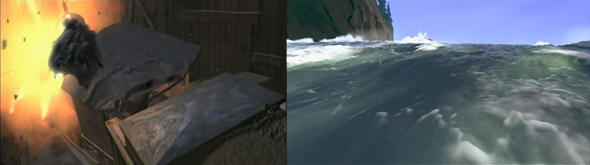
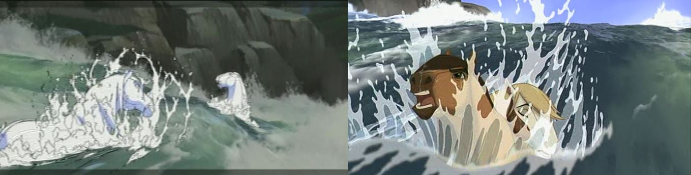
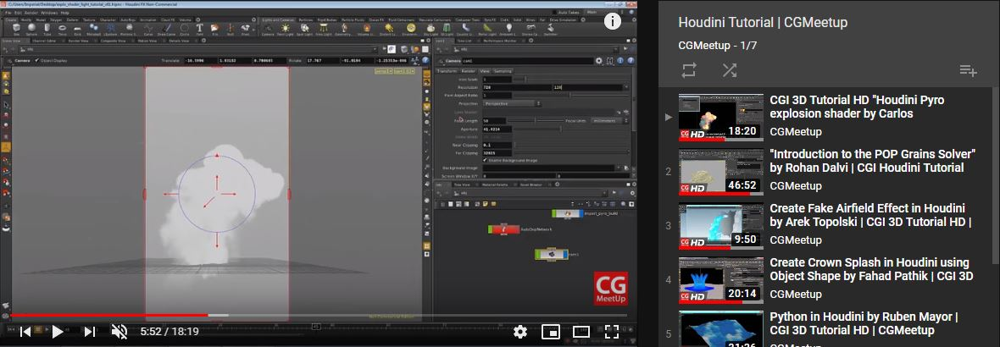

 

### Vous êtes ici

 

[Accueil](index.md)

1. [Une introduction à l'animation](histoire.md)

    - [Le développement de la 2D](2d.md)
    - [Le passage à la 3D](3d.md)
    - [L'animation en volume ou 3D réelle](envolume.md)
    
        * [Le stop-motion](stopmotion.md)
        * [La pixilation et la rotoscopie](pixilation.md)

2. [L'animation par ordinateur](parordinateur.md)

    - [Une science technologique]()
    
        * [Les formations](formation.md)
    
    - [Les images de synthèse]()
    
        * [Les principes du numérique](numerique.md)
        * **Les effets spéciaux**
        * [L'illusion des décors et accessoires](decor.md)
        
    - [La motion capture]()
    
        * [L'étude du mouvement]()
        * [La mise en mouvement]()
        * [La modélisation des corps](corps.md)

    - [Les évolutions en cours et futures](evolution.md)
    
        * [Le ray tracing ou photoréalisme]()
        
 

--------------------------------------------------------

 

# L'ANIMATION PAR ORDINATEUR
# Les images de synthèse
## Les effets spéciaux

 

Une ou deux lignes qui expliquent ce qu’on retrouve dans cette classe. Ensuite, publication des différentes ressources trouvées.

 

###### L’animation de ‘’Spirit’’. In _Spirit : Stallion of the Cimarron_. Film d’animation, aventure et famille. Réalisé par Kelly Asbury et Lorna Cook, DreamWorks. Diffusé le 9 octobre 2002. 1h 24min

> _« Dans Spirit, les effets étaient très naturels. Il y a beaucoup d’éléments organiques – eau, feu, poussière. Le travail consistait à créer les éléments naturels : le brouillard, la neige, le scintillement des étoiles. C’est un plus par rapport à l’animation traditionnelle. Une des séquences les plus spectaculaires, c’est lorsque Rivière est sauvée. Les deux personnages principaux sont emportés dans des rapides. Tandis que les personnages sont dessinés à la main, l’environnement est généré par ordinateur puis intégré à l’animation en 2D. Ça, c’est un effet d’éclaboussement dessiné à la main et c’est comme ça qu’on a obtenu cette mousse à la surface. Pour captiver le public, on a adopté un style de prise de vues réelles. On a utilisé des décors informatiques pour pouvoir se déplacer sur trois dimensions et on a mis la caméra sur l’eau, comme si elle filmait d’un radeau. Ça produit l’effet dramatique d’un tournage caméra à l’épaule. Pourvoir créer de tels effets qui sont intégrés dans ces paysages magnifiques et avec une animation incroyable… Rien que de savoir le nombre de personnes qui travaillent dessus et la réflexion que demande chaque scène, c’est impressionnant. »_

 

##### CGMeetup. « Houdini tutorial » [en ligne]. In YouTube. Publié en 2015  [consulté le 28 mai 2019]. Playlist : 7 vidéos. Disponible sur le Web : [https://www.youtube.com/watch?v=eVKODWtBmGc&list=PLc6NCp8iAPDbmC29V3rln_m6B8ZpWZtoo](https://www.youtube.com/watch?v=eVKODWtBmGc&list=PLc6NCp8iAPDbmC29V3rln_m6B8ZpWZtoo)

 
