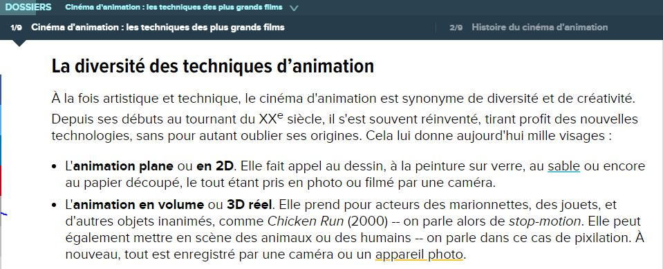

 

### Vous êtes ici

 

[Introduction à l'animation](index.md)

1. **L'animation en volume ou 3D réel**

    - [Le stop-motion](stopmotion.md)
    - [La pixilation](pixilation.md)
    
2. [L'animation par ordinateur](parordinateur.md)

    - [L'animation et effets spéciaux numériques](numerique.md)
    
        * [La 2D](2d.md)
        * [La 3D](3d.md)
        
    - [Les images de synthèse](imagesdesynthèse.md)
    
        * [L'organic motion](organicmotion.md)
        * [Le ray tracing ou photoréalisme](photorealisme.md)
        * [Le motion capture](motioncapture.md)

 

---------------------------------------------------

 

# L'animation en volume ou en 3D réel

 

Introduction sur l'animation en volume ou 3D réel.

 

#### BOYER, Floriane. "Cinéma d'animation : les techniques des plus grands films" [en ligne]. In _Futura_. Publié le 1 octobre 2018 [consulté le 5 mai 2019]. Disponible sur le Web : [https://www.futura-sciences.com/tech/dossiers/technologie-cinema-animation-techniques-plus-grands-films-2537/](https://www.futura-sciences.com/tech/dossiers/technologie-cinema-animation-techniques-plus-grands-films-2537/)

 

##### OLATS, Leonardo et CAMACHO, Véronica. «  L’émergence du concept de « cinéma d’animation » » [en ligne]. In Leonardo. Publié en octobre 2008 [consulté le 19 mai 2019]. Disponible sur le Web : [http://www.olats.org/livresetudes/basiques/animationnumerique/1_basiquesAN.php#1](http://www.olats.org/livresetudes/basiques/animationnumerique/1_basiquesAN.php#1)

 
