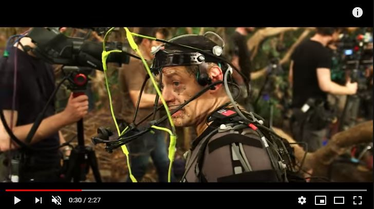
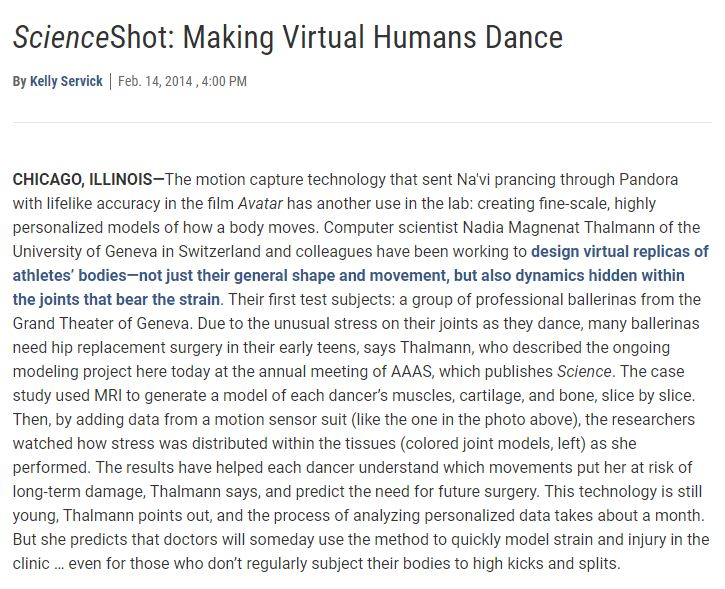

 

### Vous êtes ici

 

[Accueil](index.md)

1. [Une introduction à l'animation](histoire.md)

    - [Le développement de la 2D](2d.md)
    - [Le passage à la 3D](3d.md)
    - [L'animation en volume ou 3D réelle](envolume.md)
    
        * [Le stop-motion](stopmotion.md)
        * [La pixilation et la rotoscopie](pixilation.md)

2. [L'animation par ordinateur](parordinateur.md)

    - [Une science technologique](science.md)
    
        * [Les formations](formation.md)
    
    - [Les images de synthèse](imagesdesynthèse.md)
    
        * [Les principes du numérique](numerique.md)
        * [Les effets spéciaux](effet.md)
        * [L'illusion des décors et accessoires](decor.md)
        
    - [La motion capture](motioncapture.md)
    
        * **L'étude du mouvement**
        * [La mise en mouvement](mouvement.md)
        * [La modélisation des corps](corps.md)

    - [Les évolutions en cours et futures](evolution.md)
    
        * [Le ray tracing ou photoréalisme](photorealisme.md)
        
 

--------------------------------------------------------

 

# L'ANIMATION PAR ORDINATEUR
# La motion capture
## L'étude du mouvement

 

Cette page contient des références consacrées au développement du mouvement. Elles montrent des multiples possibilités et renseignent sur l'importance de l'étude du mouvement dans le domaine.

 

##### L’animation de ‘’Spirit’’. In _Spirit : Stallion of the Cimarron_. Film d’animation, aventure et famille. Réalisé par Kelly Asbury et Lorna Cook, DreamWorks. Diffusé le 9 octobre 2002. 1h 24min

> _« Spirit a représenté un autre challenge : celui de reproduire les mouvements complexes d’un cheval. L’animation de Spirit est complexité jamais vue. Il n’y a rien de plus difficile que d’animer un cheval. On a de la chance, ici, chez DreamWorks, d’avoir un des meilleurs animateurs actuels, James Baxter. C’était assez décourageant, au début. J’ai commencé à dessiner des chevaux et j’ai vu que j’ignorais tout. On a été voir des anatomistes, on a tout fait pour comprendre comment ces animaux fonctionnaient. C’est un sujet qui a troublé beaucoup de gens. Léonard de Vinci s’est lui-même confronté au problème. »_

> _« C’est extrêmement dur de montrer un cheval galoper correctement. Il y a beaucoup de parties. Chaque image, chaque photogramme, doit être traité à part. Il y a le cou, la tête, la crinière, deux oreilles, quatre pattes. C’est très complexe de maîtriser tout d’une image à l’autre. »_

> _« C’est dur de rendre l’expression. Donc je ne vais pas vous forcer à dessiner un cheval parfait mais je vais vous donner un point de départ qui fixera vos limites. Il a fallu dessiner une tête qui soit celle d’un cheval mais avec des éléments permettant de retranscrire l’émotion, comme les sourcils. Les chevaux n’ont pas de sourcils. Ils ont un rebord autour des yeux mais pas de sourcils comme nous. Les sourcils sont très utiles pour reproduire l’émotion. Ce qui est primordial, ce n’est pas seulement que l’anatomie soit correcte. Ce qui motive le crayon de l’animateur, c’est son cœur. Il n’y a rien d’aussi unique que ce qui se passe quand un animateur insuffle la vie à un personnage avec un crayon sur une feuille de papier. Il n’y a rien de tel. Il y a tellement d’émotion, de personnalité. Les ordinateurs n’en sont pas capables – pas encore. »_

 

##### NETFLIX. « Mowgli: Legend of the Jungle | Featurette: Capturing the Magic of Mowgli » [en ligne]. In YouTube. Publié le 9 décembre 2018  [consulté le 20 mai 2019]. 2 minutes 27 secondes. Disponible sur le Web : [https://www.youtube.com/watch?v=v7uH_ThCCOA](https://www.youtube.com/watch?v=v7uH_ThCCOA)

 

##### ORGANIC MOTION. « Organic motion announces the launch of STAGE » [en ligne]. In YouTube. Réalisé en août 20007, publié le 25 juillet 2008 [consulté le 8 juin 2019]. 2 minutes 12 secondes. Disponible sur le Web : [https://www.youtube.com/watch?v=px5_UagJ4_8&feature=youtu.be](https://www.youtube.com/watch?v=px5_UagJ4_8&feature=youtu.be)

 

##### SERVICK, Kelly. « ScienceShot: Making virtual humans dance » [en ligne]. _Sciencemag_. Publié le 14 février 2014 [consulté le 20 mai 2019], posté dans Technology, AAAS 2014. Disponible sur le Web : <https://www.sciencemag.org/news/2014/02/scienceshot-making-virtual-humans-dance>

 
