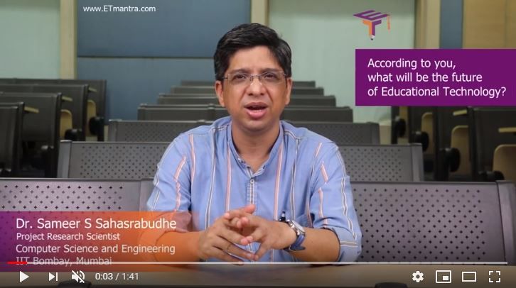
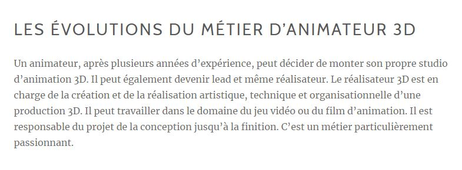
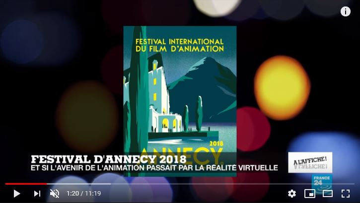

 

### Vous êtes ici

 

[Accueil](index.md)

1. [Une introduction à l'animation](histoire.md)

    - [Le développement de la 2D](2d.md)
    - [Le passage à la 3D](3d.md)
    - [L'animation en volume ou 3D réelle](envolume.md)
    
        * [Le stop-motion](stopmotion.md)
        * [La pixilation et la rotoscopie](pixilation.md)

2. [L'animation par ordinateur](parordinateur.md)

    - [Une science technologique](science.md)
    
        * [Les formations](formation.md)
    
    - [Les images de synthèse](imagesdesynthèse.md)
    
        * [Les principes du numérique](numerique.md)
        * [Les effets spéciaux](effet.md)
        * [L'illusion des décors et accessoires](decor.md)
        
    - [La motion capture](motioncapture.md)
    
        * [L'étude du mouvement](etude.md)
        * [La mise en mouvement](mouvement.md)
        * [La modélisation des corps](corps.md)

    - **Les évolutions en cours et futures**
    
        * [Le ray tracing ou photoréalisme](photorealisme.md)
        
 

--------------------------------------------------------

 

# L'ANIMATION PAR ORDINATEUR
## Les évolutions en cours et futures

 

Une ou deux lignes qui expliquent ce qu’on retrouve dans cette classe. Ensuite, publication des différentes ressources trouvées.

 

##### ET MANTRA. « What will be the future of Education Technology ? - Dr. Sameer Sahasrabudhe » [en ligne]. In YouTube. Publié le 26 octobre 2018 [consulté le 30 mai 2019]. 1 minute 41 secondes. Disponible sur le Web : [https://www.youtube.com/watch?v=ZxspBGYZ_aQ](https://www.youtube.com/watch?v=ZxspBGYZ_aQ)

 

##### MJM VIDÉO/ANIMATION. « En quoi consiste le métier d'animateur 3D » [en ligne]. [Consulté le 30 mai 2019]. Disponible sur le Web: <https://www.mjm-video-animation.com/comment-realiser-une-bonne-animation-video/>

 

##### PRUHOMME, Charlotte. « La réalité virtuelle comme avenir du film d'animation » [en ligne]. In YouTube. _France 24_. Publié le 15 juin 2018  [consulté le 30 mai 2019]. 11 minutes 19 secondes. Disponible sur le Web : [https://www.youtube.com/watch?v=dflsi4WBl8o](https://www.youtube.com/watch?v=dflsi4WBl8o)

 
