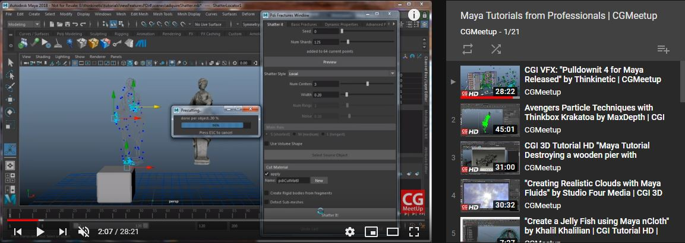
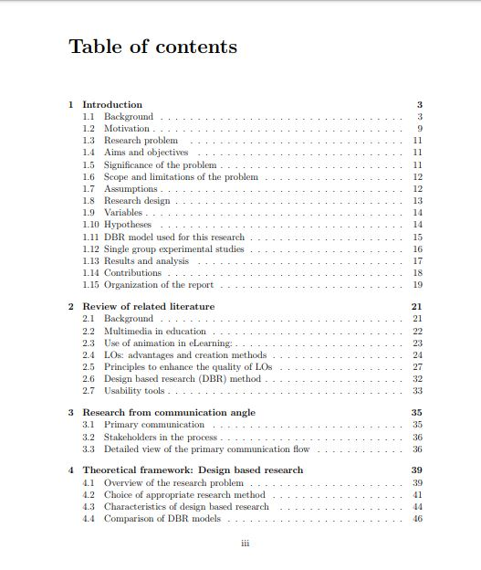
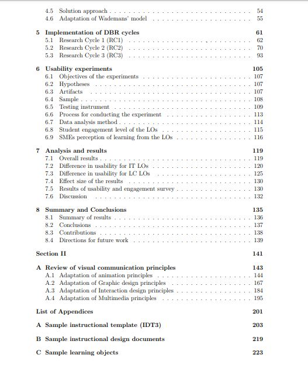
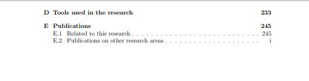

 

### Vous êtes ici

 

[Accueil](index.md)

1. [Une introduction à l'animation](histoire.md)

    - [Le développement de la 2D](2d.md)
    - [Le passage à la 3D](3d.md)
    - [L'animation en volume ou 3D réelle](envolume.md)
    
        * [Le stop-motion](stopmotion.md)
        * [La pixilation et la rotoscopie](pixilation.md)

2. [L'animation par ordinateur](parordinateur.md)

    - [Une science technologique](science.md)
    
        * **Les formations**
    
    - [Les images de synthèse](imagesdesynthèse.md)
    
        * [Les principes du numérique](numerique.md)
        * [Les effets spéciaux](effet.md)
        * [L'illusion des décors et accessoires](decor.md)
        
    - [La motion capture](motioncapture.md)
    
        * [L'étude du mouvement](etude.md)
        * [La mise en mouvement](mouvement.md)
        * [La modélisation des corps](corps.md)

    - [Les évolutions en cours et futures](evolution.md)
    
        * [Le ray tracing ou photoréalisme](photorealisme.md)
        
 

--------------------------------------------------------

 

# L'ANIMATION PAR ORDINATEUR
# Une science technologique
## Les formations

 

Cette page contient des références mettant à votre disposition deux formules de support de cours, pour une éventuelle formation ou comme simple renseignement.

 

##### CUESTA, Esteban. « Maya tutorials from professionals » [en ligne]. In YouTube. _CGMeetup_. Publié en 2018  [consulté le 9 juin 2019]. Playlist : 21 vidéos. Disponible sur le Web : [https://www.youtube.com/watch?v=Dwml8T-b4Jg&list=PLc6NCp8iAPDYJ8yJkv4n4qSuIbCwLLh7Y&index=1](https://www.youtube.com/watch?v=Dwml8T-b4Jg&list=PLc6NCp8iAPDYJ8yJkv4n4qSuIbCwLLh7Y&index=1)

 

##### SAHASRABUDHE, Sameer Suhas. _Design considerations for creating eLearning animations_ [en ligne]. IIT Bombay, 2013 [consulté le 30 mai 2019]. 271 p. Disponible sur le Web : <https://ssameers.files.wordpress.com/2018/07/sameerss_thesis04092015.pdf>. PRN: SR200149

 
