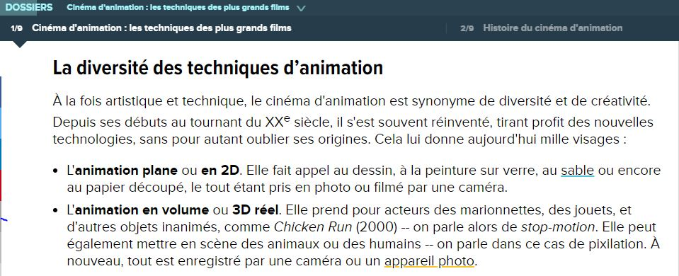
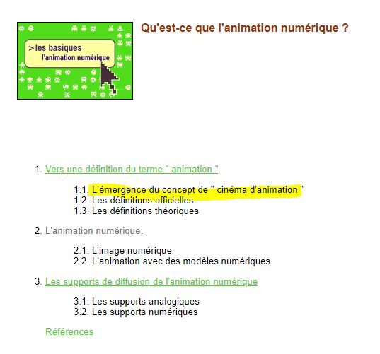

 

### Vous êtes ici

 

[Accueil](index.md)

1. **Une introduction à l'animation**

    - [Le développement de la 2D]()
    - [Le passage à la 3D]()
    - [L'animation en volume ou 3D réelle](envolume.md)
    
        * [Le stop-motion](stopmotion.md)
        * [La pixilation et la rotoscopie]()

2. [L'animation par ordinateur]()

    - [Une science technologique]()
    
        * [Les formations]()
    
    - [L'image de synthèse]()
    
        * [Les principes du numérique]()
        * [Les effets spéciaux]()
        * [La conception des décors et accessoires]()
        
 

--------------------------------------------------------

 

# Une introduction à l'animation

 

Une ou deux lignes qui expliquent ce qu’on retrouve dans cette classe. Ensuite, publication des différentes ressources trouvées.

 

#### BOYER, Floriane. "Cinéma d'animation : les techniques des plus grands films" [en ligne]. In _Futura_. Publié le 1 octobre 2018 [consulté le 5 mai 2019]. Disponible sur le Web : [https://www.futura-sciences.com/tech/dossiers/technologie-cinema-animation-techniques-plus-grands-films-2537/](https://www.futura-sciences.com/tech/dossiers/technologie-cinema-animation-techniques-plus-grands-films-2537/)

 

##### OLATS, Leonardo et CAMACHO, Véronica. «  L’émergence du concept de « cinéma d’animation » » [en ligne]. In Leonardo. Publié en octobre 2008 [consulté le 19 mai 2019]. Disponible sur le Web : [http://www.olats.org/livresetudes/basiques/animationnumerique/1_basiquesAN.php#1](http://www.olats.org/livresetudes/basiques/animationnumerique/1_basiquesAN.php#1)

 
