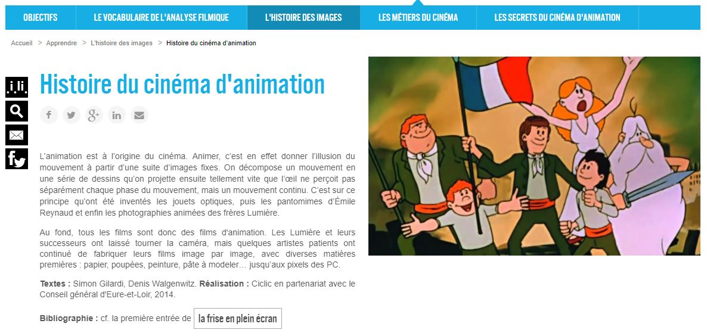

 

### Vous êtes ici

 

[Accueil](index.md)

1. **Une introduction à l'animation**

    - [Le développement de la 2D](2d.md)
    - [Le passage à la 3D](3d.md)
    - [L'animation en volume ou 3D réelle](envolume.md)
    
        * [Le stop-motion](stopmotion.md)
        * [La pixilation et la rotoscopie](pixilation.md)

2. [L'animation par ordinateur](parordinateur.md)

    - [Une science technologique](science.md)
    
        * [Les formations](formation.md)
    
    - [Les images de synthèse](imagesdesynthèse.md)
    
        * [Les principes du numérique](numerique.md)
        * [Les effets spéciaux](effet.md)
        * [L'illusion des décors et accessoires](decor.md)
        
    - [La motion capture](motioncapture.md)
    
        * [L'étude du mouvement](etude.md)
        * [La mise en mouvement](mouvement.md)
        * [La modélisation des corps](corps.md)

    - [Les évolutions en cours et futures](evolution.md)
    
        * [Le ray tracing ou photoréalisme](photorealisme.md)
        
 

--------------------------------------------------------

 

# Une introduction à l'animation

 

Cette page contient des références de sur l'animation en générale, son histoire et sa définition.

 

#### BOYER, Floriane. "Cinéma d'animation : les techniques des plus grands films" [en ligne]. In _Futura_. Publié le 1 octobre 2018 [consulté le 5 mai 2019]. Disponible sur le Web : [https://www.futura-sciences.com/tech/dossiers/technologie-cinema-animation-techniques-plus-grands-films-2537/](https://www.futura-sciences.com/tech/dossiers/technologie-cinema-animation-techniques-plus-grands-films-2537/)

 

##### CICLIC : CENTRE-VAL DE LOIRE. « Histoire du cinéma d'animation » [en ligne]. In Upopi : Université populaire des images. [Consulté le 8 juin 2019]. Disponible sur le Web : [http://upopi.ciclic.fr/apprendre/l-histoire-des-images/histoire-du-cinema-d-animation](http://upopi.ciclic.fr/apprendre/l-histoire-des-images/histoire-du-cinema-d-animation)

 

##### OLATS, Leonardo et CAMACHO, Véronica. «  L’émergence du concept de « cinéma d’animation » » [en ligne]. In Leonardo. Publié en octobre 2008 [consulté le 19 mai 2019]. Disponible sur le Web : [http://www.olats.org/livresetudes/basiques/animationnumerique/1_basiquesAN.php#1](http://www.olats.org/livresetudes/basiques/animationnumerique/1_basiquesAN.php#1)

 
