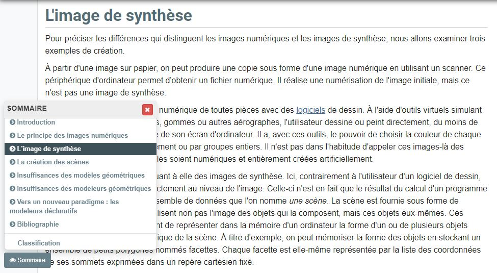

 

### Vous êtes ici

 

[Accueil](index.md)

1. [Une introduction à l'animation]

    - [Le développement de la 2D](2d.md)
    - [Le passage à la 3D](3d.md)
    - [L'animation en volume ou 3D réelle](envolume.md)
    
        * [Le stop-motion](stopmotion.md)
        * [La pixilation et la rotoscopie](pixilation.md)

2. [L'animation par ordinateur](parordinateur.md)

    - [Une science technologique](science.md)
    
        * [Les formations](formation.md)
    
    - **Les images de synthèse**
    
        * [Les principes du numérique](numerique.md)
        * [Les effets spéciaux](effet.md)
        * [L'illusion des décors et accessoires](decor.md)
        
    - [La motion capture]()
    
        * [L'étude du mouvement]()
        * [La mise en mouvement]()
        * [La modélisation des corps](corps.md)

    - [Les évolutions en cours et futures](evolution.md)
    
        * [Le ray tracing ou photoréalisme]()
        
 

--------------------------------------------------------

 

# L'animation par ordinateur
# Les images de synthèse

 

Une ou deux lignes qui expliquent ce qu’on retrouve dans cette classe. Ensuite, publication des différentes ressources trouvées.

 

##### LAROUSSE.  « Image de synthèse » [en ligne]. [Consulté le 19 mai 2019]. Disponible sur le Web : [http://www.larousse.fr/encyclopedie/divers/image_de_synthèse/185998](http://www.larousse.fr/encyclopedie/divers/image_de_synthèse/185998)

 

##### MARTIN, Philippe et MARTIN, Dominique. « Images numérique et image de synthèse : L'image de synthèse » [en ligne]. In _Encyclopædia Universalis_. [Consulté le 19 mai 2019]. Disponible sur le Web: [https://www.universalis.fr/encyclopedie/image-numerique-et-image-de-synthese/2-l-image-de-synthese/](https://www.universalis.fr/encyclopedie/image-numerique-et-image-de-synthese/2-l-image-de-synthese/)

 
