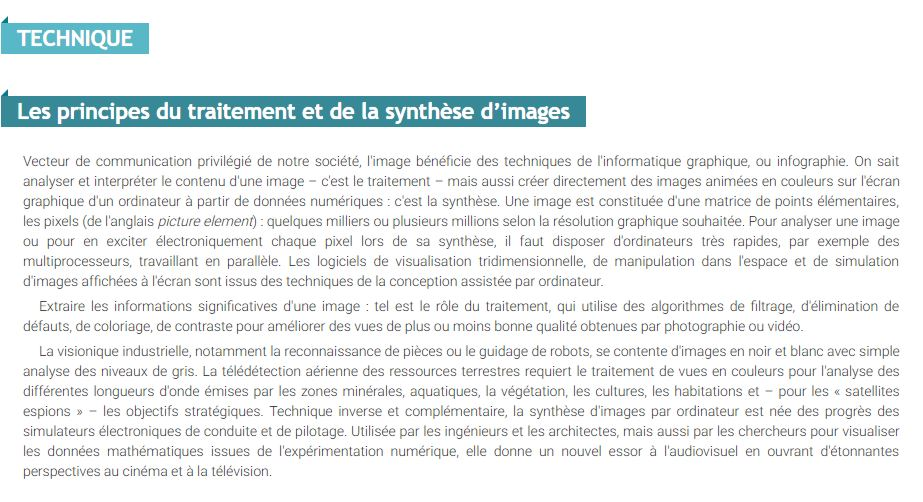

 

### Vous êtes ici

 

[Introduction à l'animation](index.md)

1. [L'animation en volume ou 3D réel](envolume.md)

    - [Le stop-motion](stopmotion.md)
    - [La pixilation](pixilation.md)
    
2. [L'animation par ordinateur](parordinateur.md)

    - [L'animation et effets spéciaux numériques](numerique.md)
    
        * [La 2D](2d.md)
        * [La 3D](3d.md)
        
    - **Les images de synthèse**    
        * [L'organic motion](organicmotion.md)
        * [Le ray tracing ou photoréalisme](photorealisme.md)
        * [Le motion capture](motioncapture.md)

 

------------------------------------------------------

 

# L'animation par ordinateur

## Les images de synthèse

 

Explication du principe de base.

 

##### LAROUSSE.  "Image de synthèse" [en ligne]. [Consulté le 19 mai 2019]. Disponible sur le Web : [<http://www.larousse.fr/encyclopedie/divers/image_de_synthèse/185998>](http://www.larousse.fr/encyclopedie/divers/image_de_synthèse/185998)

 

###### Suite des références

 
