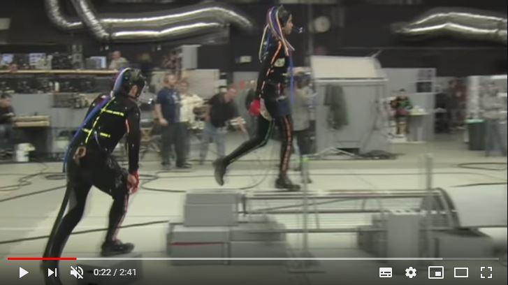
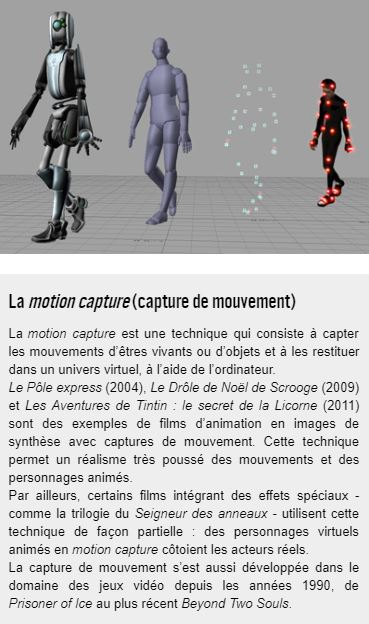
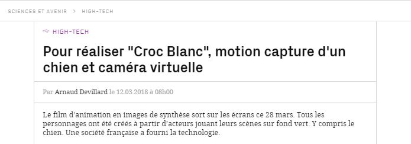
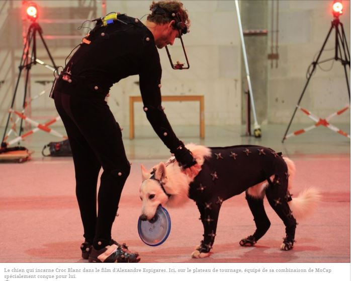
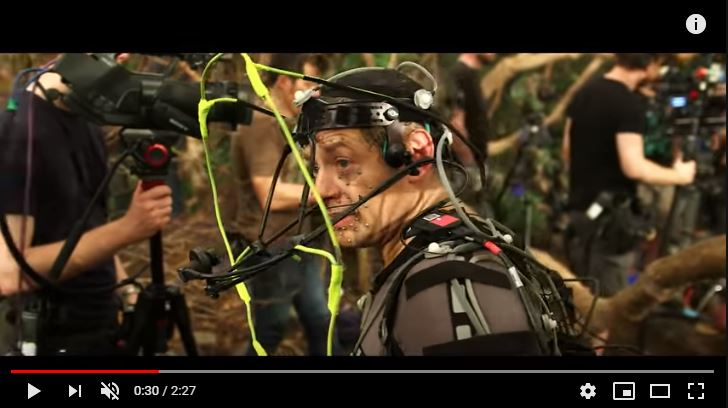
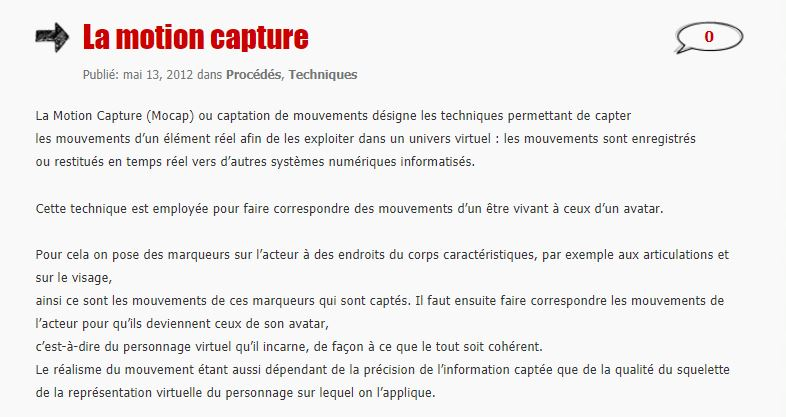
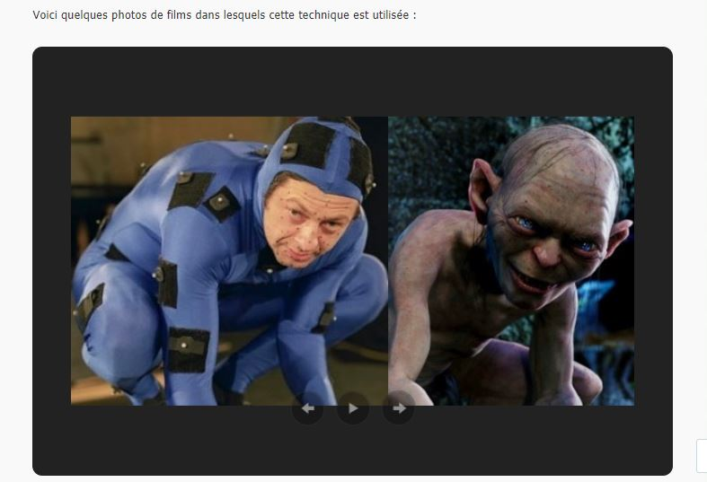

 

### Vous êtes ici

 

[Accueil](index.md)

1. [Une introduction à l'animation](histoire.md)

    - [Le développement de la 2D](2d.md)
    - [Le passage à la 3D](3d.md)
    - [L'animation en volume ou 3D réelle](envolume.md)
    
        * [Le stop-motion](stopmotion.md)
        * [La pixilation et la rotoscopie](pixilation.md)

2. [L'animation par ordinateur](parordinateur.md)

    - [Une science technologique](science.md)
    
        * [Les formations](formation.md)
    
    - [Les images de synthèse](imagesdesynthèse.md)
    
        * [Les principes du numérique](numerique.md)
        * [Les effets spéciaux](effet.md)
        * [L'illusion des décors et accessoires](decor.md)
        
    - **La motion capture**
    
        * [L'étude du mouvement](etude.md)
        * [La mise en mouvement](mouvement.md)
        * [La modélisation des corps](corps.md)

    - [Les évolutions en cours et futures](evolution.md)
    
        * [Le ray tracing ou photoréalisme](photorealisme.md)
        
 

--------------------------------------------------------

 

# L'animation par ordinateur
## La motion capture

 

Une ou deux lignes qui expliquent ce qu’on retrouve dans cette classe. Ensuite, publication des différentes ressources trouvées.

 

##### A-RENAUD. « Tout savoir sur la motion capture, une technologie en plein boom ! » [en ligne]. In _Réalité-virtuelle.com : le magazine des professionels de la réalité virtuelle & augmentée_. Publié le 17 janvier 2016 [consulté le 5 mai 2019]. Disponible sur le Web : <https://www.realite-virtuelle.com/tout-savoir-motion-capture>

 

-------------------------------------------

 

### Vous êtes ici

 

[Introduction à l'animation](index.md)

1. [L'animation en volume ou 3D réel](envolume.md)

    - [Le stop-motion](stopmotion.md)
    - [La pixilation](pixilation.md)
    
2. [L'animation par ordinateur](parordinateur.md)

    - [L'animation et effets spéciaux numériques](numerique.md)
    
        * [La 2D](2d.md)
        * [La 3D](3d.md)
        
    - [Les images de synthèse](imagesdesynthèse.md)
    
        * [L'organic motion](organicmotion.md)
        * [Le ray tracing ou photoréalisme](photorealisme.md)
        * **Le motion capture**

 

---------------------------------------------------

 

# L'ANIMATION PAR ORDINATEUR

# Les images de synthèse

## Le motion capture

 

Explicationet précision du sujet.

 

##### A-RENAUD. « Tout savoir sur la motion capture, une technologie en plein boom ! » [en ligne]. In _Réalité-virtuelle.com : le magazine des professionels de la réalité virtuelle & augmentée_. Publié le 17 janvier 2016 [consulté le 5 mai 2019]. Disponible sur le Web : <https://www.realite-virtuelle.com/tout-savoir-motion-capture>

 

##### CAMERON, James. « Avatar : motion capture mirrors emotions » [en ligne]. In YouTube. _Discovery_. Publié le 24 décembre 2009 [consulté le 20 mai 2019]. 2 minutes 41 secondes. Disponible sur le Web : [https://www.youtube.com/watch?v=1wK1Ixr-UmM](https://www.youtube.com/watch?v=1wK1Ixr-UmM)

 

##### CICLIC CENTRE-VAL DE LOIRE. « Séance 9 : animation par ordinateur » [en ligne]. In _Upopi : Université populaire des images. 2014 [consulté le 19 mai 2019]_. Disponible sur le Web : [http://upopi.ciclic.fr/transmettre/parcours-pedagogiques/initiation-au-cinema-d-animation/seance-9-animation-par-ordinateur](http://upopi.ciclic.fr/transmettre/parcours-pedagogiques/initiation-au-cinema-d-animation/seance-9-animation-par-ordinateur)

 

##### DEVILLARD, Arnaud. « Pour réaliser "Croc Blanc", motion capture d'un chien et caméra virtuelle » [en ligne]. In _Sciences et Avenir_. Publié le 12 mars 2018 [consulté le 19 mai 2019]. Disponible sur le Web : [https://www.sciencesetavenir.fr/high-tech/pour-realiser-croc-blanc-motion-capture-d-un-chien-et-camera-virtuelle_121874](https://www.sciencesetavenir.fr/high-tech/pour-realiser-croc-blanc-motion-capture-d-un-chien-et-camera-virtuelle_121874)

 

##### MOLET, Tom ; HUANG, Zhiyong ; BOULIC, Ronan et THALMANN, Daniel. _An animation interface designed for motion capture_ [en ligne]. Lausanne : IEEE Press, MIRALab, [consulté le 8 juin 2019]. 10 p. Disponible sur le Web : [https://mafiadoc.com/an-animation-interface-designed-for-motion-capture-miralab_5ba66113097c4761288b4662.html](https://mafiadoc.com/an-animation-interface-designed-for-motion-capture-miralab_5ba66113097c4761288b4662.html). ISBN 0-8186-7984-0

 

##### NETFLIX. « Mowgli: Legend of the Jungle | Featurette: Capturing the Magic of Mowgli » [en ligne]. In YouTube. Publié le 9 décembre 2018  [consulté le 20 mai 2019]. 2 minutes 27 secondes. Disponible sur le Web : [https://www.youtube.com/watch?v=v7uH_ThCCOA](https://www.youtube.com/watch?v=v7uH_ThCCOA)

 

##### SERVICK, Kelly. « ScienceShot: Making virtual humans dance » [en ligne]. _Sciencemag_. Publié le 14 février 2014 [consulté le 20 mai 2019], posté dans Technology, AAAS 2014. Disponible sur le Web : <https://www.sciencemag.org/news/2014/02/scienceshot-making-virtual-humans-dance>

 

##### STRUMAN, David J. _A brief history of motion capture for computer character animation_ [en ligne]. Paris : Médialab, mis à jour le 13 mars 1999 [consulté le 19 mai 2019]. Disponible sur le Web : [https://www.siggraph.org/education/materials/HyperGraph/animation/character_animation/motion_capture/history1.htm](https://www.siggraph.org/education/materials/HyperGraph/animation/character_animation/motion_capture/history1.htm)

 

##### WORDPRESS. « La motion capture » [en ligne]. In _Les effets spéciaux numériques_. [Consulté le 5 mai 2019]. Disponible sur le Web: [https://effetsspeciaux.wordpress.com/2012/05/13/la-motion-capture/](https://effetsspeciaux.wordpress.com/2012/05/13/la-motion-capture/)

 
