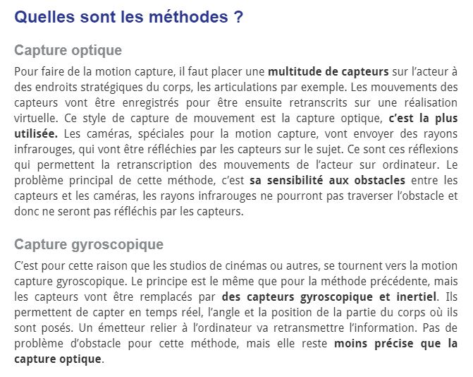
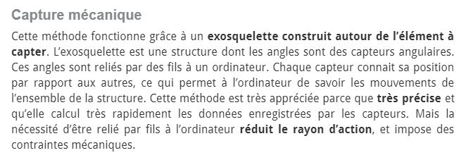
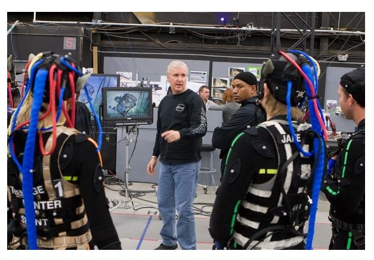
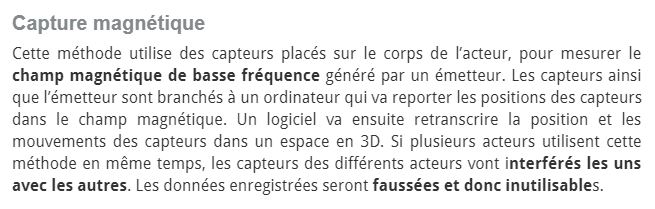

 

### Vous êtes ici

 

[Introduction à l'animation](index.md)

1. [L'animation en volume ou 3D réel](envolume.md)

    - [Le stop-motion](stopmotion.md)
    - [La pixilation](pixilation.md)
    
2. [L'animation par ordinateur](parordinateur.md)

    - [L'animation et effets spéciaux numériques](numerique.md)
    
        * [La 2D](2d.md)
        * [La 3D](3d.md)
        
    - [Les images de synthèse](imagesdesynthèse.md)
    
        * [L'organic motion](organicmotion.md)
        * [Le ray tracing ou photoréalisme](photorealisme.md)
        * **Le motion capture**

 

---------------------------------------------------

 

# L'ANIMATION PAR ORDINATEUR
# Les images de synthèse

## Le motion capture

 

Explicationet précision du sujet.

 

#### A-RENAUD. "Tout savoir sur la motion capture, une technologie en plein boom !" [en ligne]. In _Réalité-virtuelle.com : le magazine des professionels de la réalité virtuelle & augmentée_. Publié le 17 janvier 2016 [consulté le 5 mai 2019]. Disponible sur le Web : <https://www.realite-virtuelle.com/tout-savoir-motion-capture>

 

Suite des références :

<iframe width="560" height="315"
    src="https://www.youtube.com/watch?v=v7uH_ThCCOA" 
    frameborder="0" 
    allow="accelerometer; autoplay; encrypted-media; gyroscope; picture-in-picture" 
    allowfullscreen></iframe>

<object width="425" height="350">
  <param name="movie" value="https://www.youtube.com/watch?v=v7uH_ThCCOA"/>
  <param name="wmode" value="transparent"/>
  <embed src="https://www.youtube.com/watch?v=v7uH_ThCCOA"
         type="application/x-shockwave-flash"
         wmode="transparent" width="425" height="350"/>
</object>

 
