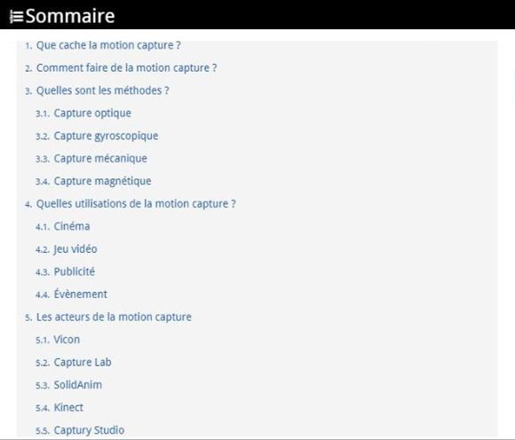

 

### Vous êtes ici

 

[Introduction à l'animation](index.md)

1. [L'animation en volume ou 3D réel](envolume.md)

    - [Le stop-motion](stopmotion.md)
    - [La pixilation](pixilation.md)
    
2. [L'animation par ordinateur](parordinateur.md)

    - [L'animation et effets spéciaux numériques](numerique.md)
    
        * [La 2D](2d.md)
        * [La 3D](3d.md)
        
    - [Les images de synthèse](imagesdesynthèse.md)
    
        * [L'organic motion](organicmotion.md)
        * [Le ray tracing ou photoréalisme](photorealisme.md)
        * **Le motion capture**

 

---------------------------------------------------

 

# L'ANIMATION PAR ORDINATEUR

# Les images de synthèse

## Le motion capture

 

Explicationet précision du sujet.

 

##### A-RENAUD. "Tout savoir sur la motion capture, une technologie en plein boom !" [en ligne]. In _Réalité-virtuelle.com : le magazine des professionels de la réalité virtuelle & augmentée_. Publié le 17 janvier 2016 [consulté le 5 mai 2019]. Disponible sur le Web : <https://www.realite-virtuelle.com/tout-savoir-motion-capture>

 

##### MOLET, Tom ; HUANG, Zhiyong ; BOULIC, Ronan et THALMANN, Daniel. _An animation interface designed for motion capture_ [en ligne]. Lausanne : IEEE Press, MIRALab, [consulté le 8 juin 2019]. 10 p. Disponible sur le Web : [https://mafiadoc.com/an-animation-interface-designed-for-motion-capture-miralab_5ba66113097c4761288b4662.html](https://mafiadoc.com/an-animation-interface-designed-for-motion-capture-miralab_5ba66113097c4761288b4662.html). ISBN 0-8186-7984-0

 

##### SERVICK, Kelly. « ScienceShot: Making virtual humans dance » [en ligne]. _Sciencemag_. Publié le 14 février 2014 [consulté le 20 mai 2019], posté dans Technology, AAAS 2014. Disponible sur le Web : <https://www.sciencemag.org/news/2014/02/scienceshot-making-virtual-humans-dance>

 

##### STRUMAN, David J. _A brief history of motion capture for computer character animation_ [en ligne]. Paris : Médialab, mis à jour le 13 mars 1999 [consulté le 19 mai 2019]. Disponible sur le Web : [https://www.siggraph.org/education/materials/HyperGraph/animation/character_animation/motion_capture/history1.htm](https://www.siggraph.org/education/materials/HyperGraph/animation/character_animation/motion_capture/history1.htm)

 
