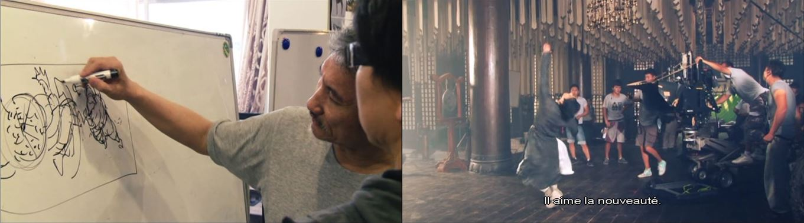
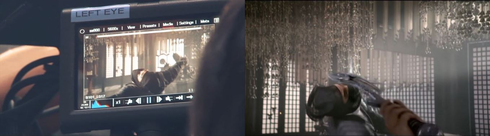

 

### Vous êtes ici

 

[Accueil](index.md)

1. Une introduction à l'animation](histoire.md)

    - [Le développement de la 2D](2d.md)
    - [Le passage à la 3D](3d.md)
    - [L'animation en volume ou 3D réelle](envolume.md)
    
        * [Le stop-motion](stopmotion.md)
        * [La pixilation et la rotoscopie](pixilation.md)

2. [L'animation par ordinateur](parordinateur.md)

    - [Une science technologique](science.md)
    
        * [Les formations](formation.md)
    
    - [Les images de synthèse](imagesdesynthèse.md)
    
        * [Les principes du numérique](numerique.md)
        * [Les effets spéciaux](effet.md)
        * [L'illusion des décors et accessoires](decor.md)
        
    - [La motion capture](motioncapture.md)
    
        * [L'étude du mouvement](etude.md)
        * **La mise en mouvement**
        * [La modélisation des corps](corps.md)

    - [Les évolutions en cours et futures](evolution.md)
    
        * [Le ray tracing ou photoréalisme](photorealisme.md)
        
 

--------------------------------------------------------

 

# L'ANIMATION PAR ORDINATEUR
# La motion capture
## La mise en mouvement

 

Une ou deux lignes qui expliquent ce qu’on retrouve dans cette classe. Ensuite, publication des différentes ressources trouvées.

 

##### ORGANIC MOTION. « Accueil : Organic motion » [en ligne]. In YouTube. [Consulté le 7 juin 2019]. Disponible sur le Web: [https://www.youtube.com/channel/UCbUxf7QvfZuEKajDc6UFAqw](https://www.youtube.com/channel/UCbUxf7QvfZuEKajDc6UFAqw)

 

##### Tsui Hark et les combats. In _Di Renjie : Shen du long wang_. Film d’action, aventure et arts martiaux. Réalisé par Tsui Hark, Huayi Corporation. Diffusé le 6 août 2014. 2h 14min

> _« Le cinéma doit conjurer tous les sens. Le cinéma chinois s’internationalise. Il s’inspire beaucoup de sa tradition et de sa culture. Et du wuxia. Quel est le trésor du cinéma chinois ? Le kung-fu, bien sûr. Tsui Hark a son propre style, sa propre vision du kung-fu et du wuxia. Ses créations sont très différent de celle des autres. (...) Cette fois, les difficultés sont nombreuses. On a trois fois plus de scènes de combat. On s’est lancé de vrais défis. Les mouvements inventés par Tsui Hark sont très originaux, différents des gestes habituels. Il aime la nouveauté. Comment faire pour renouveler des gestes vus et revus ? »_

> _« Il a un bon coup de crayon. Comme pour_ II était une fois en Chine, _il a dessiné toute la scène. Lorsque j’ai rencontré Tsui Hark à Pékin, on s’est mis d’accord pour faire preuve de réalisme. On voulait donc que Yuchi soit très bon en voltige. Il lui suffit d’un point d’appui pour ‘’s’envoler’’. Il connaît les points vitaux. Bien sûr le résultat à l’écran est exagéré. (…) Les films d’action chinois en 3D sont rares. »_

 
