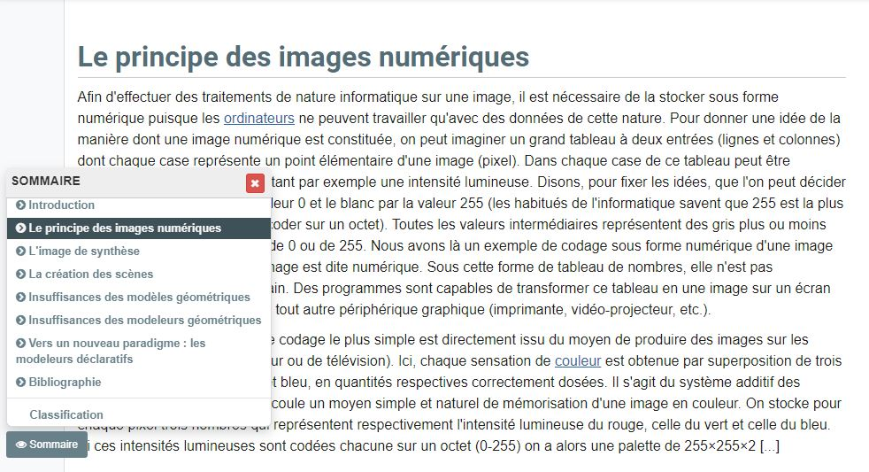
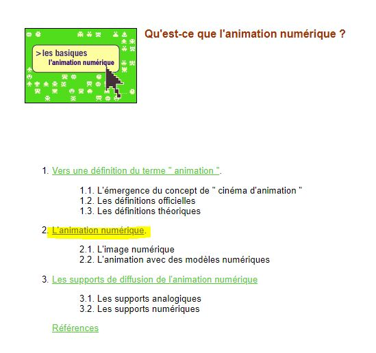
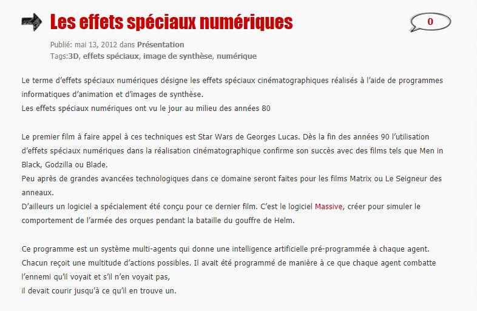

 

### Vous êtes ici

 

[Accueil](index.md)

1. [Une introduction à l'animation](histoire.md)

    - [Le développement de la 2D](2d.md)
    - [Le passage à la 3D](3d.md)
    - [L'animation en volume ou 3D réelle](envolume.md)
    
        * [Le stop-motion](stopmotion.md)
        * [La pixilation et la rotoscopie](pixilation.md)

2. [L'animation par ordinateur](parordinateur.md)

    - [Une science technologique]()
    
        * [Les formations](formation.md)
    
    - [Les images de synthèse]()
    
        * **Les principes du numérique**
        * [Les effets spéciaux](effet.md)
        * [L'illusion des décors et accessoires](decor.md)
        
    - [La motion capture]()
    
        * [L'étude du mouvement]()
        * [La mise en mouvement]()
        * [La modélisation des corps]()

    - [Les évolutions en cours et futures](evolution.md)
    
        * [Le ray tracing ou photoréalisme]()
        
 

--------------------------------------------------------

 

# L'ANIMATION PAR ORDINATEUR
# Les images de synthèse
## Les principes du numériques

 

Une ou deux lignes qui expliquent ce qu’on retrouve dans cette classe. Ensuite, publication des différentes ressources trouvées.

 

##### MARTIN, Philippe et MARTIN, Dominique. « Images numérique et image de synthèse : Le principe des images numériques » [en ligne]. In _Encyclopædia Universalis_. [Consulté le 19 mai 2019]. Disponible sur le Web: [https://www.universalis.fr/encyclopedie/image-numerique-et-image-de-synthese/1-le-principe-des-images-numeriques/](https://www.universalis.fr/encyclopedie/image-numerique-et-image-de-synthese/1-le-principe-des-images-numeriques/)

 

##### OLATS, Leonardo et CAMACHO, Véronica. « L'animation numérique » [en ligne]. In Leonardo. Publié en octobre 2008 [consulté le 19 mai 2019]. Disponible sur le Web: [http://www.olats.org/livresetudes/basiques/animationnumerique/1_basiquesAN.php#2](http://www.olats.org/livresetudes/basiques/animationnumerique/1_basiquesAN.php#2)

 

##### WORDPRESS. « Les effets spéciaux numériques » [en ligne]. In _Les effets spéciaux numériques_. [Consulté le 5 mai 2019]. Disponible sur le Web: [https://effetsspeciaux.wordpress.com/2012/05/13/les-effets-speciaux-numeriques/](https://effetsspeciaux.wordpress.com/2012/05/13/les-effets-speciaux-numeriques/)

 
