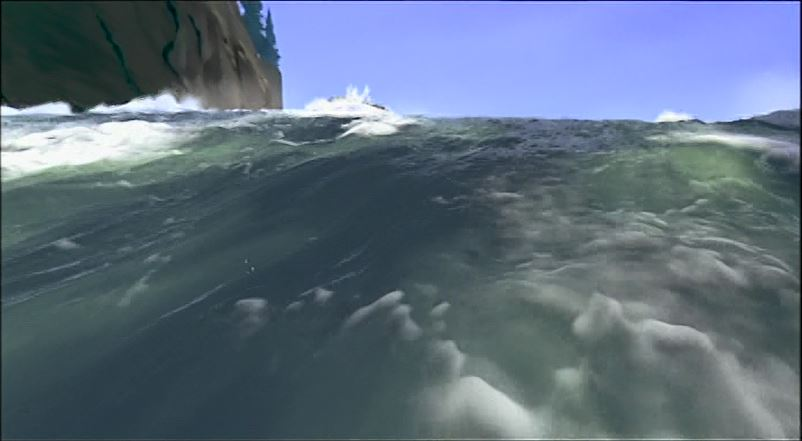
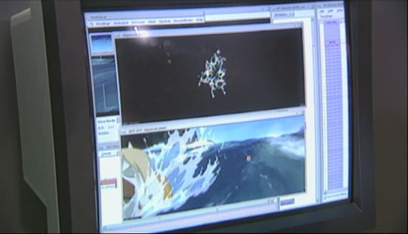

 

#### Vous êtes ici

 

[Introduction à l'animation](index.md)

1. [L'animation en volume ou 3D réel](envolume.md)

    - [Le stop-motion](stopmotion.md)
    - [La pixilation](pixilation.md)
    
2. [L'animation par ordinateur](parordinateur.md)

    - **L'animation et effets spéciaux numériques**
    
        * [La 2D](2d.md)
        * [La 3D](3d.md)
        
    - [Les images de synthèse](imagesdesynthèse.md)    
        * [L'organic motion](organicmotion.md)
        * [Le ray tracing ou photoréalisme](photorealisme.md)
        * [Le motion capture](motioncapture.md)

 

------------------------------------------------------------------

 

# L'animation par ordinateur

## L'animation et effets spéciaux numériques

 

Explication au sujet.

 

##### Capture de la cascade du film d'animation Spirit.

> _Note des dires intéressants et explicatifs du principe._

 

###### MJM VIDÉO/ANIMATION. « En quoi consiste le métier d'animateur 3D » [en ligne]. [Consulté le 30 mai 2019]. Disponible sur le Web: <https://www.mjm-video-animation.com/comment-realiser-une-bonne-animation-video/>

 
