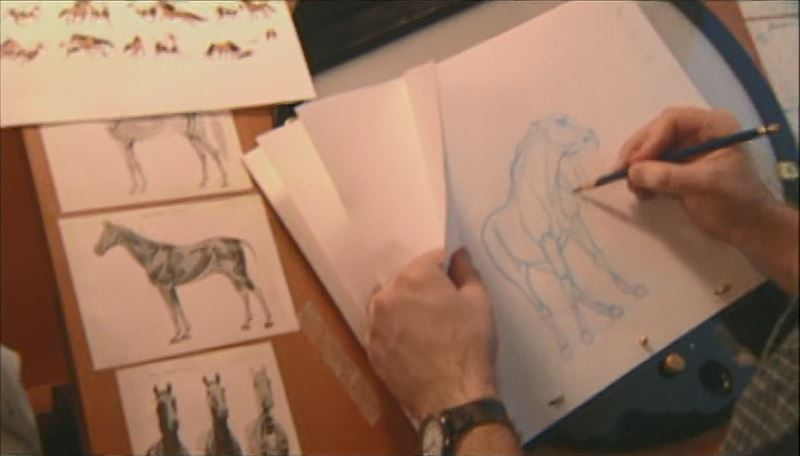
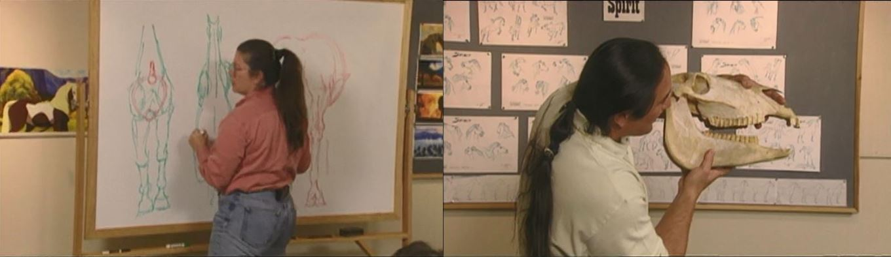

 

### Vous êtes ici

 

[Introduction à l'animation](index.md)

1. [L'animation en volume ou 3D réel](envolume.md)

    - [Le stop-motion](stopmotion.md)
    - [La pixilation](pixilation.md)
    
2. [L'animation par ordinateur](parordinateur.md)

    - [L'animation et effets spéciaux numériques](numerique.md)
    
        * [La 2D](2d.md)
        * [La 3D](3d.md)
        
    - [Les images de synthèse](imagesdesynthèse.md)    
        * **L'organic motion**
        * [Le ray tracing ou photoréalisme](photorealisme.md)
        * [Le motion capture](motioncapture.md)

 

------------------------------------------------------------------

 

# L'ANIMATION PAR ORDINATEUR

# Les images de synthèse

## L'organic motion

 

Explication blablabla...

 

##### L’animation de ‘’Spirit’’. In _Spirit : Stallion of the Cimarron_. Film d’animation, aventure et famille. Réalisé par Kelly Asbury et Lorna Cook, DreamWorks. Diffusé le 9 octobre 2002. 1h 24min

> _« Spirit a représenté un autre challenge : celui de reproduire les mouvements complexes d’un cheval. L’animation de Spirit est complexité jamais vue. Il n’y a rien de plus difficile que d’animer un cheval. On a de la chance, ici, chez DreamWorks, d’avoir un des meilleurs animateurs actuels, James Baxter. C’était assez décourageant, au début. J’ai commencé à dessiner des chevaux et j’ai vu que j’ignorais tout. On a été voir des anatomistes, on a tout fait pour comprendre comment ces animaux fonctionnaient. C’est un sujet qui a troublé beaucoup de gens. Léonard de Vinci s’est lui-même confronté au problème. »_

> _« C’est extrêmement dur de montrer un cheval galoper correctement. Il y a beaucoup de parties. Chaque image, chaque photogramme, doit être traité à part. Il y a le cou, la tête, la crinière, deux oreilles, quatre pattes. C’est très complexe de maîtriser tout d’une image à l’autre. »_

> _« C’est dur de rendre l’expression. Donc je ne vais pas vous forcer à dessiner un cheval parfait mais je vais vous donner un point de départ qui fixera vos limites. Il a fallu dessiner une tête qui soit celle d’un cheval mais avec des éléments permettant de retranscrire l’émotion, comme les sourcils. Les chevaux n’ont pas de sourcils. Ils ont un rebord autour des yeux mais pas de sourcils comme nous. Les sourcils sont très utiles pour reproduire l’émotion. Ce qui est primordial, ce n’est pas seulement que l’anatomie soit correcte. Ce qui motive le crayon de l’animateur, c’est son cœur. Il n’y a rien d’aussi unique que ce qui se passe quand un animateur insuffle la vie à un personnage avec un crayon sur une feuille de papier. Il n’y a rien de tel. Il y a tellement d’émotion, de personnalité. Les ordinateurs n’en sont pas capables – pas encore. »_

 

##### Tsui Hark et les combats. In _Di Renjie : Shen du long wang_. Film d’action, aventure et arts martiaux. Réalisé par Tsui Hark, Huayi Corporation. Diffusé le 6 août 2014. 2h 14min

> _« Le cinéma doit conjurer tous les sens. Le cinéma chinois s’internationalise. Il s’inspire beaucoup de sa tradition et de sa culture. Et du wuxia. Quel est le trésor du cinéma chinois ? Le kung-fu, bien sûr. Tsui Hark a son propre style, sa propre vision du kung-fu et du wuxia. Ses créations sont très différent de celle des autres. (...) Cette fois, les difficultés sont nombreuses. On a trois fois plus de scènes de combat. On s’est lancé de vrais défis. Les mouvements inventés par Tsui Hark sont très originaux, différents des gestes habituels. Il aime la nouveauté. Comment faire pour renouveler des gestes vus et revus ? »_

> _« Il a un bon coup de crayon. Comme pour_ II était une fois en Chine, _il a dessiné toute la scène. Lorsque j’ai rencontré Tsui Hark à Pékin, on s’est mis d’accord pour faire preuve de réalisme. On voulait donc que Yuchi soit très bon en voltige. Il lui suffit d’un point d’appui pour ‘’s’envoler’’. Il connaît les points vitaux. Bien sûr le résultat à l’écran est exagéré. (…) Les films d’action chinois en 3D sont rares. »_

 
