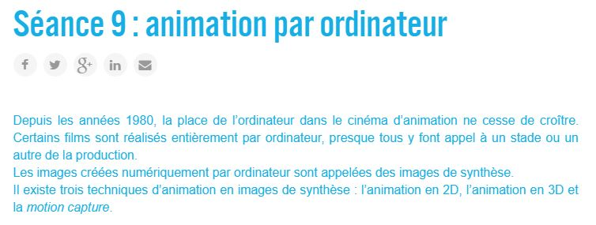
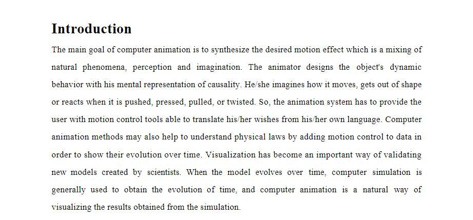
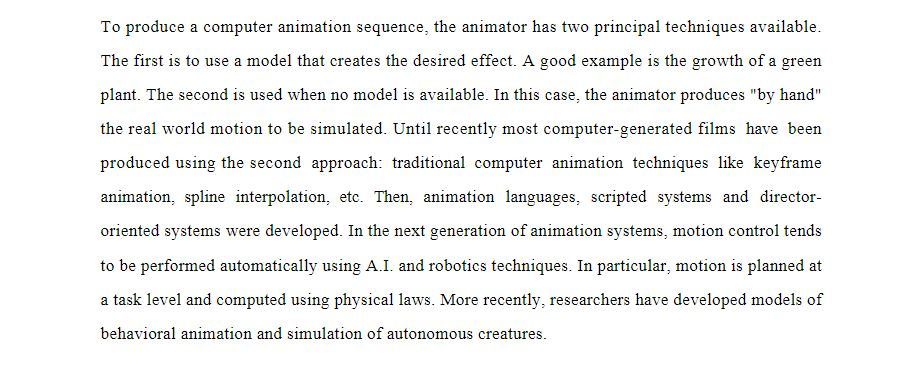

 

### Vous êtes ici

 

[Accueil](index.md)

1. [Une introduction à l'animation](histoire.md)

    - [Le développement de la 2D]()
    - [Le passage à la 3D](3d.md)
    - [L'animation en volume ou 3D réelle](envolume.md)
    
        * [Le stop-motion](stopmotion.md)
        * [La pixilation et la rotoscopie](pixilation.md)

2. **L'animation par ordinateur**

    - [Une science technologique]()
    
        * [Les formations](formation.md)
    
    - [Les images de synthèse]()
    
        * [Les principes du numérique](numerique.md)
        * [Les effets spéciaux]()
        * [L'illusion des décors et accessoires](decor.md)
        
    - [La motion capture]()
    
        * [L'étude du mouvement]()
        * [La mise en mouvement]()
        * [La modélisation des corps]()

    - [Les évolutions en cours et futures](evolution.md)
    
        * [Le ray tracing ou photoréalisme]()
        
 

--------------------------------------------------------

 

# L'animation par ordinateur

 

Une ou deux lignes qui expliquent ce qu’on retrouve dans cette classe. Ensuite, publication des différentes ressources trouvées.

 

##### CICLIC CENTRE-VAL DE LOIRE. « Séance 9 : animation par ordinateur » [en ligne]. In _Upopi : Université populaire des images. 2014 [consulté le 19 mai 2019]_. Disponible sur le Web : [http://upopi.ciclic.fr/transmettre/parcours-pedagogiques/initiation-au-cinema-d-animation/seance-9-animation-par-ordinateur](http://upopi.ciclic.fr/transmettre/parcours-pedagogiques/initiation-au-cinema-d-animation/seance-9-animation-par-ordinateur)

 

##### THALMANN, Nadia Magnenat et THALMANN, Daniel. _Computer animation_ [en ligne]. Suisse : MIRALab, [consulté le 7 juin 2019]. 32 p. Disponible sur le Web : [https://mafiadoc.com/computer-animation-miralab_5babbe0f097c4732038b456b.html](https://mafiadoc.com/computer-animation-miralab_5babbe0f097c4732038b456b.html)

 
