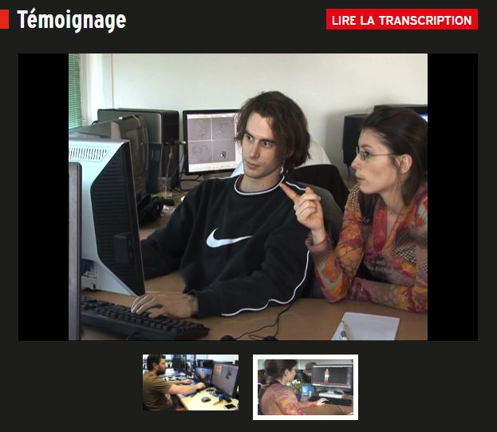

 

### Vous êtes ici

 

[Introduction à l'animation](index.md)

1. [L'animation en volume ou 3D réel](envolume.md)

    - [Le stop-motion](stopmotion.md)
    - [La pixilation](pixilation.md)
    
2. **L'animation par ordinateur**

    - [L'animation et effets spéciaux numériques](numerique.md)
    
        * [La 2D](2d.md)
        * [La 3D](3d.md)
        
    - [Les images de synthèse](imagesdesynthèse.md)
    
        * [L'organic motion](organicmotion.md)
        * [Le ray tracing ou photoréalisme](photorealisme.md)
        * [Le motion capture](motioncapture.md)

 

--------------------------------------------------------------

 

# L'animation par ordinateur

 

Définition générale de la technique et ses variantes.

 

##### SAHASRABUDHE, Sameer Suhas. _Design considerations for creating eLearning animations_ [en ligne]. IIT Bombay, 2013 [consulté le 30 mai 2019]. 271 p. Disponible sur le Web : <https://ssameers.files.wordpress.com/2018/07/sameerss_thesis04092015.pdf>. PRN: SR200149

 

##### THALMANN, Nadia Magnenat et THALMANN, Daniel. _Computer animation_ [en ligne]. Suisse : MIRALab, [consulté le 7 juin 2019]. 32 p. Disponible sur le Web : [https://mafiadoc.com/computer-animation-miralab_5babbe0f097c4732038b456b.html](https://mafiadoc.com/computer-animation-miralab_5babbe0f097c4732038b456b.html)

 

##### VALLÉE, Réjane ; RENOUARD, Caroline et YUN, Christine. « Animateur/animatrice 2D et 3d : Témoignage » [en ligne]. In Onisep. 2014 [consulté le 30 mai 2019]. 4 minutes 12 secondes et 2 minutes 26 secondes. Disponible sur le Web : [http://www.onisep.fr/Ressources/Univers-Metier/Metiers/animateur-animatrice-2D-et-3D](http://www.onisep.fr/Ressources/Univers-Metier/Metiers/animateur-animatrice-2D-et-3D)

 
