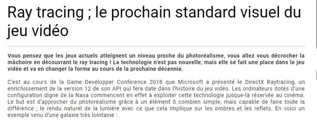
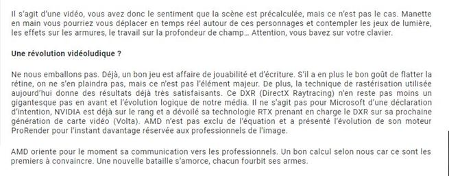
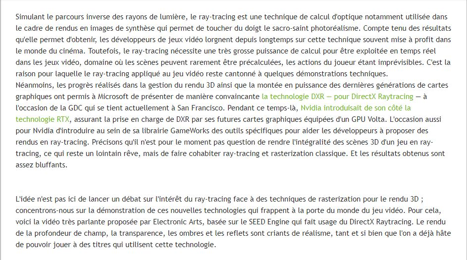
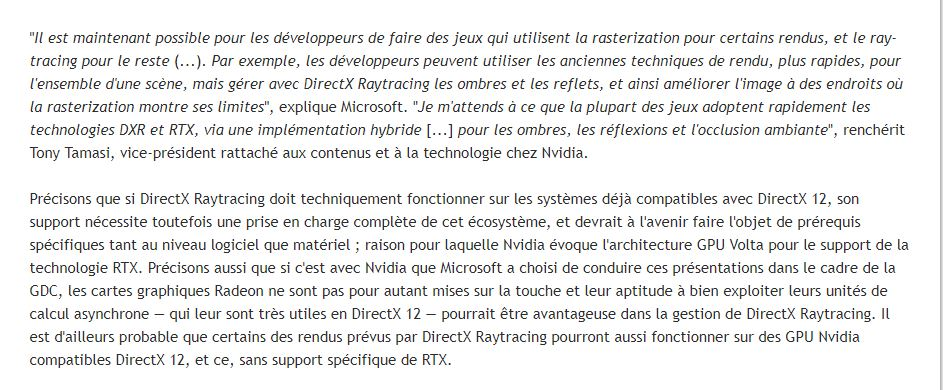
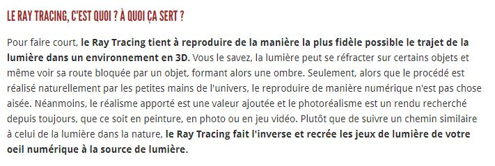
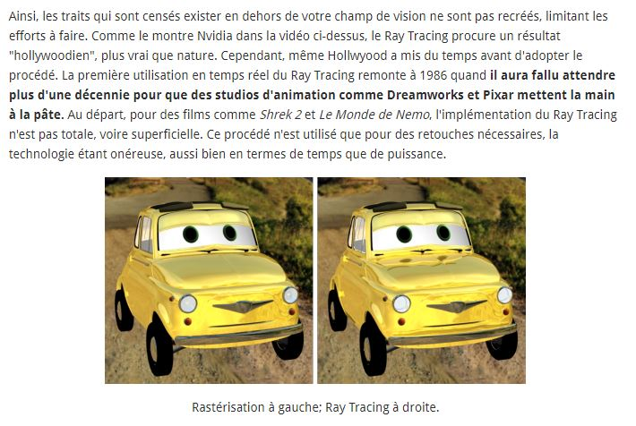
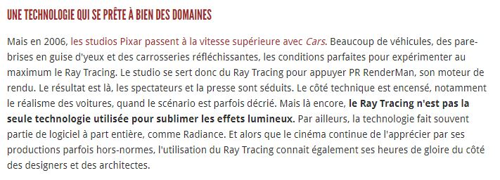
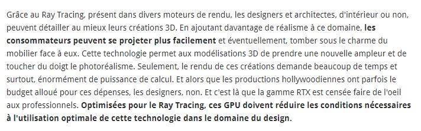
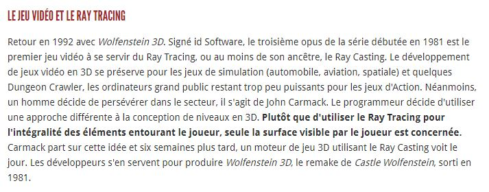
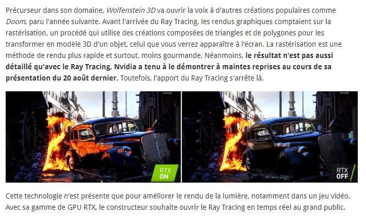

 

### Vous êtes ici

 

[Accueil](index.md)

1. [Une introduction à l'animation](histoire.md)

    - [Le développement de la 2D](2d.md)
    - [Le passage à la 3D](3d.md)
    - [L'animation en volume ou 3D réelle](envolume.md)
    
        * [Le stop-motion](stopmotion.md)
        * [La pixilation et la rotoscopie](pixilation.md)

2. [L'animation par ordinateur](parordinateur.md)

    - [Une science technologique](science.md)
    
        * [Les formations](formation.md)
    
    - [Les images de synthèse](imagesdesynthèse.md)
    
        * [Les principes du numérique](numerique.md)
        * [Les effets spéciaux](effet.md)
        * [L'illusion des décors et accessoires](decor.md)
        
    - [La motion capture](motioncapture.md)
    
        * [L'étude du mouvement](etude.md)
        * [La mise en mouvement](mouvement.md)
        * [La modélisation des corps](corps.md)

    - [Les évolutions en cours et futures](evolution.md)
    
        * **Le ray tracing ou photoréalisme**
        
 

--------------------------------------------------------

 

# L'ANIMATION PAR ORDINATEUR
# Les évolutions en cours et futures
## Le ray tracing ou photoréalisme

 

Une ou deux lignes qui expliquent ce qu’on retrouve dans cette classe. Ensuite, publication des différentes ressources trouvées.

 

##### BLOG BY MATERIEL.NET. « Ray tracing ; le prochain standard visuel du jeu vidéo » [en ligne]. Publié le 14 mai 2018 [consulté le 19 mai 2019]. Disponible sur le Web : [https://blog.materiel.net/ray-tracing-le-prochain-standard-visuel-du-jeu-video/](https://blog.materiel.net/ray-tracing-le-prochain-standard-visuel-du-jeu-video/)

 

##### CHARLIER, Mathieu. « [MàJ] DirectX Raytracing, un rendu encore plus réaliste pour les jeux » [en ligne]. In _Les numériques_. Publié le 21 mars 2018 [consulté le 19 mai 2019]. Disponible sur le Web : [https://www.lesnumeriques.com/loisirs/directx-raytracing-rendu-toujours-plus-realiste-pour-jeux-n72623.html](https://www.lesnumeriques.com/loisirs/directx-raytracing-rendu-toujours-plus-realiste-pour-jeux-n72623.html)

 

##### HITEK.FR. « Dossier : tout savoir sur le Ray Tracing, l'éblouissante technologie mise en avant par Nvidia » [en ligne]. Publié le 30 août 2018 [consulté le 19 mai 2019]. Disponible sur le Web: [https://hitek.fr/actualite/dossier-tout-savoir-ray-tracing_17175](https://hitek.fr/actualite/dossier-tout-savoir-ray-tracing_17175)

 
