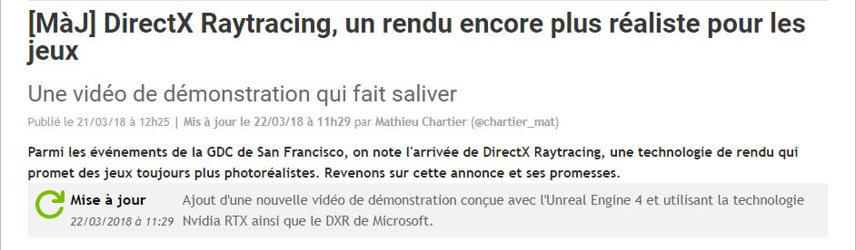

 

### Vous êtes ici

 

[Introduction à l'animation](index.md)

1. [L'animation en volume ou 3D réel](envolume.md)

    - [Le stop-motion](stopmotion.md)
    - [La pixilation](pixilation.md)
    
2. [L'animation par ordinateur](parordinateur.md)

    - [L'animation et effets spéciaux numériques](numerique.md)
    
        * [La 2D](2d)
        * [La 3D](3d.md)
        
    - [Les images de synthèse](imagesdesynthèse.md)
    
        * [L'organic motion](organicmotion.md)
        * **Le ray tracing ou photoréalisme**
        * [Le motion capture](motioncapture.md)

 

---------------------------------------------------------

 

# L'ANIMATION PAR ORDINATEUR
# Les images de synthèse
## Le ray tracing ou photoréalisme

 

Explication brève.

 

#### CHARLIER, Mathieu. "[MàJ] DirectX Raytracing, un rendu encore plus réaliste pour les jeux" [en ligne]. In _Les numériques_. Publié le 21 mars 2018 [consulté le 19 mai 2019]. Disponible sur le Web : <https://www.lesnumeriques.com/loisirs/directx-raytracing-rendu-toujours-plus-realiste-pour-jeux-n72623.html>

 

##### Deuxième référence :

 

###### Troisième référence :

 
