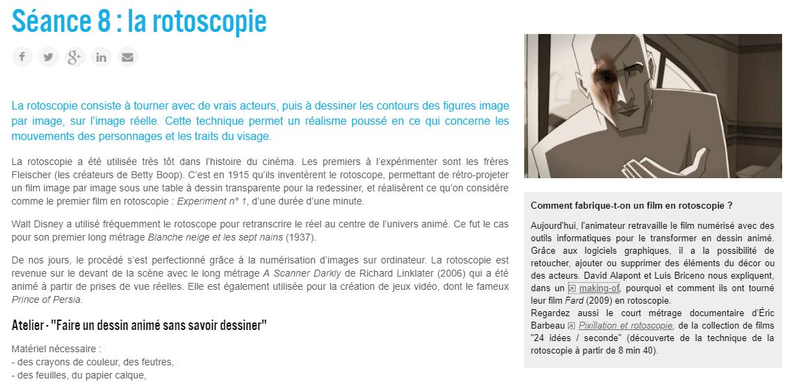
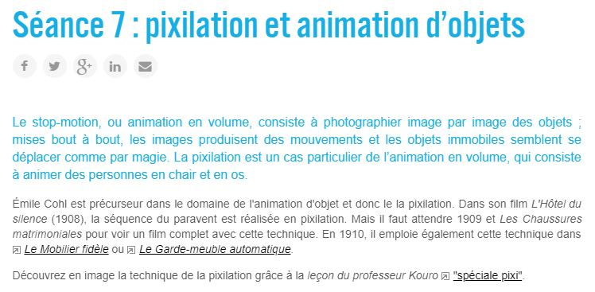
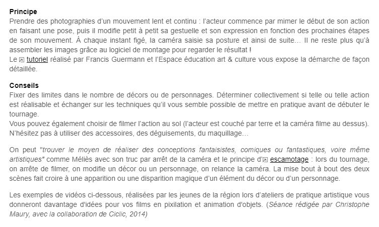
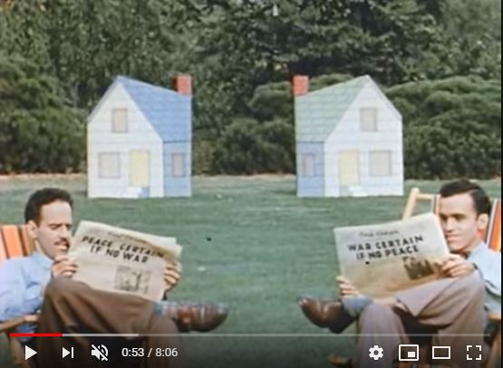
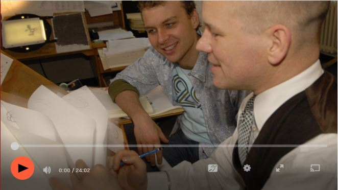

 

### Vous êtes ici

 

[Accueil](index.md)

1. [Une introduction à l'animation](histoire.md)

    - [Le développement de la 2D](2d.md)
    - [Le passage à la 3D](3d.md)
    - [L'animation en volume ou 3D réelle](envolume.md)
    
        * [Le stop-motion](stopmotion.md)
        * **La pixilation et la rotoscopie**

2. [L'animation par ordinateur](parordinateur.md)

    - [Une science technologique](science.md)
    
        * [Les formations](formation.md)
    
    - [Les images de synthèse](imagesdesynthèse.md)
    
        * [Les principes du numérique](numerique.md)
        * [Les effets spéciaux](effet.md)
        * [L'illusion des décors et accessoires](decor.md)
        
    - [La motion capture]()
    
        * [L'étude du mouvement]()
        * [La mise en mouvement]()
        * [La modélisation des corps](corps.md)

    - [Les évolutions en cours et futures](evolution.md)
    
        * [Le ray tracing ou photoréalisme]()
        
 

--------------------------------------------------------

 

# UNE INTRODUCTION À L'ANIMATION
# L'animation en volume ou 3D réelle
## La pixilation et la rotoscopie

 

Une ou deux lignes qui expliquent ce qu’on retrouve dans cette classe. Ensuite, publication des différentes ressources trouvées.

 

##### CICLIC CENTRE-VAL DE LOIRE. « Séance 8 : la rotoscopie » [en ligne]. In _Upopi : Université populaire des images_. 2014 [consulté le 19 mai 2019]. Disponible sur le Web : [http://upopi.ciclic.fr/transmettre/parcours-pedagogiques/initiation-au-cinema-d-animation/seance-8-la-rotoscopie](http://upopi.ciclic.fr/transmettre/parcours-pedagogiques/initiation-au-cinema-d-animation/seance-8-la-rotoscopie)

 

##### MAURY, Christophe. « Séance 7 : pixilation et animation d’objets » [en ligne]. In _Upopi : Université populaire des images_. 2014 [consulté le 19 mai 2019]. Disponible sur le Web : [http://upopi.ciclic.fr/transmettre/parcours-pedagogiques/initiation-au-cinema-d-animation/seance-7-pixilation-et-animation-d-objets](http://upopi.ciclic.fr/transmettre/parcours-pedagogiques/initiation-au-cinema-d-animation/seance-7-pixilation-et-animation-d-objets)

 

##### MCLAREN, Norman. « Norman McLaren - Neighbours » [en ligne]. In YouTube. The National Film Board of Canada (NFO). Réalisé en 1952, publié le 5 novembre 2011  [consulté le 8 juin 2019]. 8 minutes 6 secondes. Disponible sur le Web : [https://www.youtube.com/watch?v=4YAYGi8rQag](https://www.youtube.com/watch?v=4YAYGi8rQag)

 

##### TILBY, Wendy et FORBIS, Amanda. « 24 idées / seconde - pixillation et rotoscopie » [en ligne]. In Canada.ca. _National Film Board of Canada (NFB)_. Publié en 2006 [consulté le 8 juin 2019]. 24 minutes 3 secondes. Disponible sur le Web : [https://www.onf.ca/film/24_idees_seconde_pixillation_rotoscopie/](https://www.onf.ca/film/24_idees_seconde_pixillation_rotoscopie/)

 
