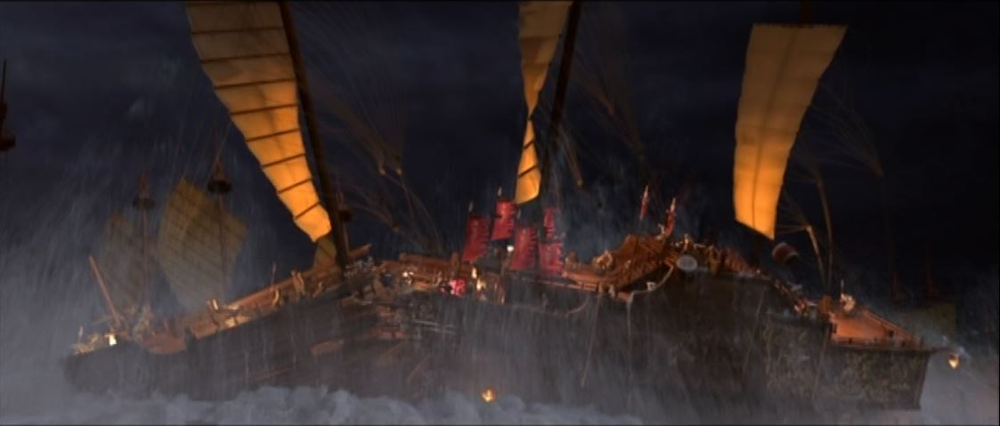
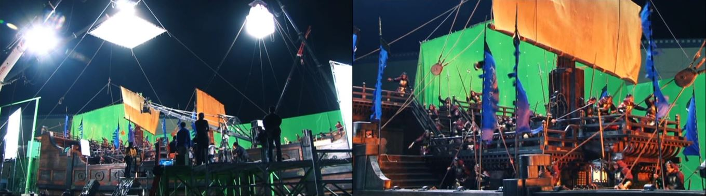

 

### Vous êtes ici

 

[Introduction à l'animation](index.md)

1. [L'animation en volume ou 3D réel](envolume.md)

    - [Le stop-motion](stopmotion.md)
    - **La pixilation**
    
2. [L'animation par ordinateur](parordinateur.md)

    - [L'animation et effets spéciaux numériques](numerique.md)
    
        * [La 2D](2d.md)
        * [La 3D](3d.md)
        
    - [Les images de synthèse](imagesdesynthèse.md)
    
        * [L'organic motion](organicmotion.md)
        * [Le ray tracing ou photoréalisme](phtorealisme.md)
        * [Le motion capture](motioncapture.md)

 

--------------------------------------------------------------------

 

# L'animation en volume ou 3D réel

## La pixilation

 

Explication brève de la technique.

 

##### Bonus : Décors et costumes. In _Di Renjie : Shen du long wang_. Film d’action, aventure et arts martiaux. Réalisé par Tsui Hark, Huayi Corporation. Diffusé le 6 août 2014. 2h 14min

> _« L’île des Chauves-souris est un assemblage de six décors. On a reconstruit tout un navire en studio, avec la proue, les mâts, et le pont tout entier. Chaque navire doit pouvoir bouger. On y a consacré un après-midi. On veut faire rêver le public pendant toute la durée du film. »_

> _« Yuchi se bat avec trois épées et une balle en acier. Le faux doit se confondre avec le vrai, car dès que l’épée apparaît, le public ne voit qu’elle. Il faut qu’il y croie. Les accessoires inspirent Tsui Hark et lui donnent des idées. Shatuo porte un sac fourre-tout avec les objets de son maître. Des remèdes, des outils… On trouve de tout là-dedans. Tout peut servir. Huo Yi, en s’aidant des mains et des jambes, peut se déplacer le long des parois d’une falaise. Son arme de prédilection est une canne qui cache en réalité une lame. Grâce à elle, il n’a jamais été vaincu. »_

 

##### CICLIC CENTRE-VAL DE LOIRE. « Séance 8 : la rotoscopie » [en ligne]. In _Upopi : Université populaire des images_. 2014 [consulté le 19 mai 2019]. Disponible sur le Web : [http://upopi.ciclic.fr/transmettre/parcours-pedagogiques/initiation-au-cinema-d-animation/seance-8-la-rotoscopie](http://upopi.ciclic.fr/transmettre/parcours-pedagogiques/initiation-au-cinema-d-animation/seance-8-la-rotoscopie)

 

##### MAURY, Christophe. « Séance 7 : pixilation et animation d’objets » [en ligne]. In _Upopi : Université populaire des images_. 2014 [consulté le 19 mai 2019]. Disponible sur le Web : [http://upopi.ciclic.fr/transmettre/parcours-pedagogiques/initiation-au-cinema-d-animation/seance-7-pixilation-et-animation-d-objets](http://upopi.ciclic.fr/transmettre/parcours-pedagogiques/initiation-au-cinema-d-animation/seance-7-pixilation-et-animation-d-objets)

 

##### TILBY, Wendy et FORBIS, Amanda. « 24 idées / seconde - pixillation et rotoscopie » [en ligne]. In Canada.ca. _National Film Board of Canada (NFB)_. Publié en 2006 [consulté le 8 juin 2019]. 24 minutes 3 secondes. Disponible sur le Web : [https://www.onf.ca/film/24_idees_seconde_pixillation_rotoscopie/](https://www.onf.ca/film/24_idees_seconde_pixillation_rotoscopie/)

 
