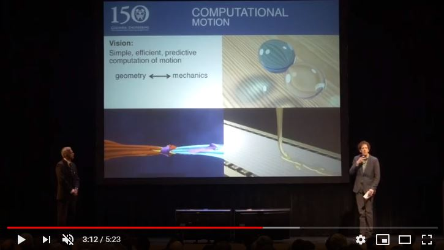
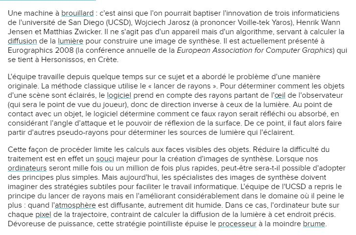
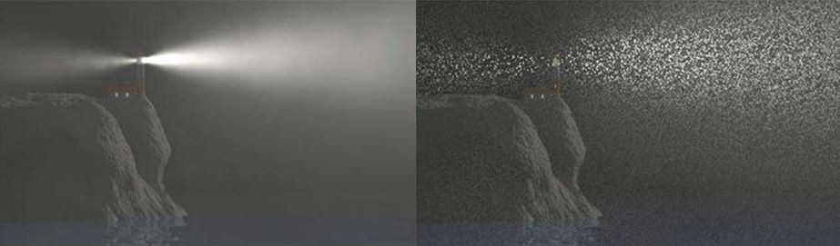
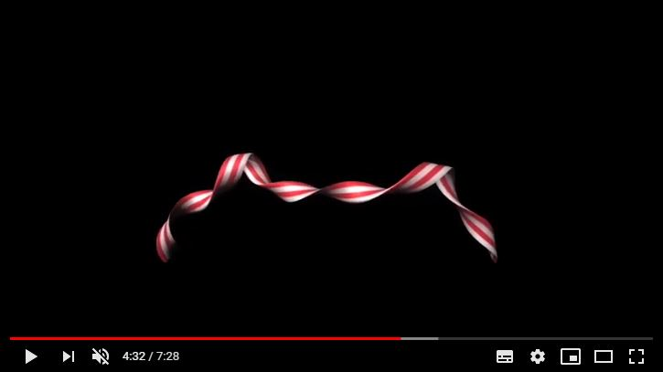

 

### Vous êtes ici

 

[Accueil](index.md)

1. [Une introduction à l'animation](histoire.md)

    - [Le développement de la 2D](2d.md)
    - [Le passage à la 3D](3d.md)
    - [L'animation en volume ou 3D réelle](envolume.md)
    
        * [Le stop-motion](stopmotion.md)
        * [La pixilation et la rotoscopie](pixilation.md)

2. [L'animation par ordinateur](parordinateur.md)

    - **Une science technologique**
    
        * [Les formations](formation.md)
    
    - [Les images de synthèse](imagesdesynthèse.md)
    
        * [Les principes du numérique](numerique.md)
        * [Les effets spéciaux](effet.md)
        * [L'illusion des décors et accessoires](decor.md)
        
    - [La motion capture](motioncapture.md)
    
        * [L'étude du mouvement](etude.md)
        * [La mise en mouvement](mouvement.md)
        * [La modélisation des corps](corps.md)

    - [Les évolutions en cours et futures](evolution.md)
    
        * [Le ray tracing ou photoréalisme](photorealisme.md)
        
 

--------------------------------------------------------

 

# L'animation par ordinateur
# Une science technologique

 

Une ou deux lignes qui expliquent ce qu’on retrouve dans cette classe. Ensuite, publication des différentes ressources trouvées.

 

##### FREUDENSTEIN, Ferdiand ; AGRAWAL,  Sunil et GRINSPUN, Eitan. « 150th Anniversary Symposium : Columbia's Engineering Renaissance. Motion. 08 » [en ligne]. In YouTube. _Columbia Engineering_. Publié le 1 décembre 2014  [consulté le 30 mai 2019]. 5 minutes 23 secondes. Disponible sur le Web : [https://www.youtube.com/watch?v=sYCR4HQv5xo](https://www.youtube.com/watch?v=sYCR4HQv5xo)

 

##### GOUDET, Jean-Luc. « Images de synthèse : des progrès... dans le brouillard » [en ligne]. In _Futura Tech_. Publié le 21 avril 2008 [consulté le 19 mai 2019]. Disponible sur le Web : [https://www.futura-sciences.com/tech/actualites/informatique-images-synthese-progres-brouillard-15298/](https://www.futura-sciences.com/tech/actualites/informatique-images-synthese-progres-brouillard-15298/)

 

##### GRINSPUN, Eitan. « Movie magic : the mathematics behind Hollywood's visual effects » [en ligne]. In YouTube. _Mathematical Association of America_. Publié le 15 mars 2017 [consulté le 30 mai 2019]. 7 minutes 28 secondes. Disponible sur le Web : [https://www.youtube.com/watch?v=LQ0aKAhjV40](https://www.youtube.com/watch?v=LQ0aKAhjV40)

 
