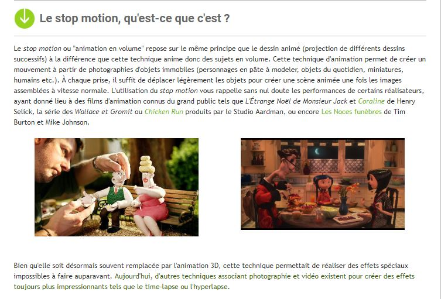
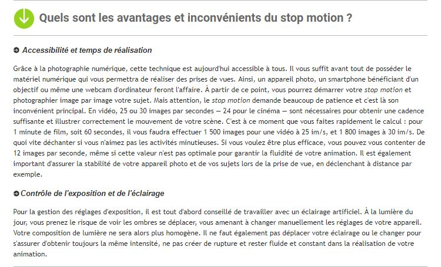
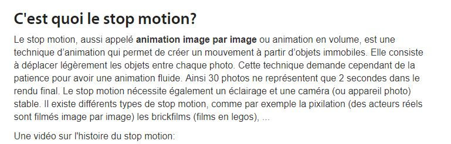
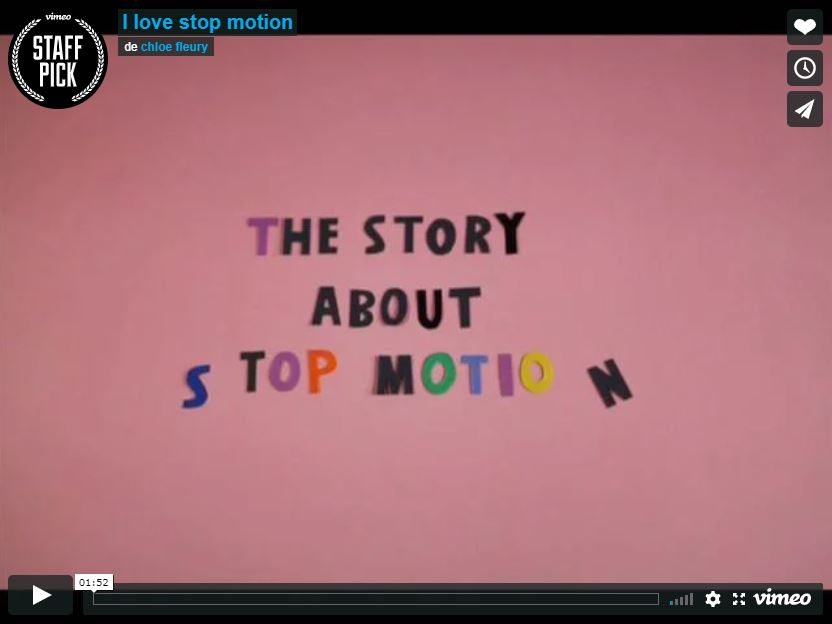

 

### Vous êtes ici

 

[Accueil](index.md)

1. [Une introduction à l'animation](histoire.md)

    - [Le développement de la 2D]()
    - [Le passage à la 3D]()
    - [L'animation en volume ou 3D réelle](envolume.md)
    
        * **Le stop-motion**
        * [La pixilation et la rotoscopie]()

2. [L'animation par ordinateur]()

    - [Une science technologique]()
    
        * [Les formations]()
    
    - [Les images de synthèse]()
    
        * [Les principes du numérique]()
        * [Les effets spéciaux]()
        * [L'illusion des décors et accessoires](decor.md)
        
    - [La motion capture]()
    
        * [L'étude du mouvement]()
        * [La mise en mouvement]()
        * [La modélisation des corps]()

    - [Les évolutions en cours et futures]()
    
        * [Le ray tracing ou photoréalisme]()
        
 

--------------------------------------------------------

 

# UNE INTRODUCTION À L'ANIMATION
# L'animation en volume ou 3D réelle
## Le stop-motion

 

Une ou deux lignes qui expliquent ce qu’on retrouve dans cette classe. Ensuite, publication des différentes ressources trouvées.

 

##### NEBOR, Céline. « Le stop-motion : comment réaliser un court métrage pour Noël » [en ligne]. In Les numériques. Publié le 26 décembre 2014 [consulté le 19 mai 2019]. Disponible sur le Web: [https://www.lesnumeriques.com/appareil-photo-numerique/stop-motion-comment-realiser-court-metrage-pour-noel-a1981.html](https://www.lesnumeriques.com/appareil-photo-numerique/stop-motion-comment-realiser-court-metrage-pour-noel-a1981.html)

 

##### RAFFIN, Antonin. Le Monde Du Stop Motion [en ligne]. Publié le 5 avril 2012 [consulté le 19 mai 2019]. Disponible sur le Web : [https://www.lemondedustopmotion.fr/](https://www.lemondedustopmotion.fr/news/voir/1/Bienvenue_sur_le_monde_du_stop_motion)

 
