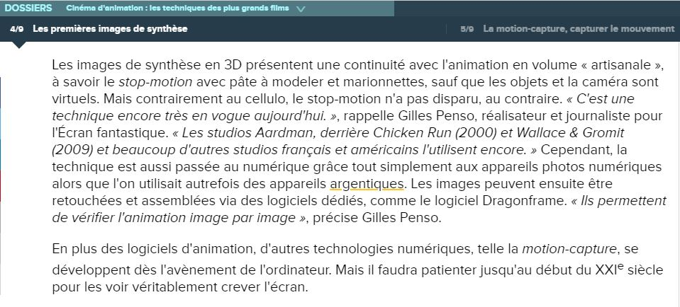

# Le stop-motion

Définition du principe du stop-motion.

Début de cette partie du plan de classement :

Première référence :

BOYER, Floriane. "Les premières images de synthèse" [en ligne]. In _Cinéma d'animation : les techniques des plus grands films_. Publié le 1 octobre 2018 [consulté le 5 mai 2019]. Disponible sur le Web : [https://www.futura-sciences.com/tech/dossiers/technologie-cinema-animation-techniques-plus-grands-films-2537/](https://www.futura-sciences.com/tech/dossiers/technologie-cinema-animation-techniques-plus-grands-films-2537/page/4)

Deuxième référence :

