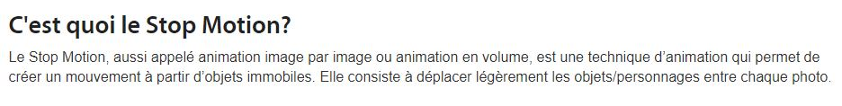

1. [Introduction à l'animation](index.md)

1. [L'animation en volume ou 3D réel](envolume.md)

    - **Le stop-motion**
    - La pixilation
    
2. L'animation par ordinateur

    - L'animation et effets spéciaux numériques
    
        * La 2D
        * La 3D
        
    - Les images de synthèse
    
        * L'organic motion
        * Le ray tracing ou photoréalisme
        * [Le motion capture](motioncapture.md)
        
---------------------------------------------------

# L'animation en volume ou 3D réel

## Le stop-motion

Définition du principe du stop-motion.

Début de cette partie du plan de classement :

Première référence :

#### BOYER, Floriane. "Dossier - Cinéma d'animation : Les premières images de synthèse" [en ligne]. In _Futura_. Publié le 1 octobre 2018 [consulté le 5 mai 2019]. Disponible sur le Web : [https://www.futura-sciences.com/tech/dossiers/technologie-cinema-animation-techniques-plus-grands-films-2537/](https://www.futura-sciences.com/tech/dossiers/technologie-cinema-animation-techniques-plus-grands-films-2537/page/4)

Deuxième référence :

